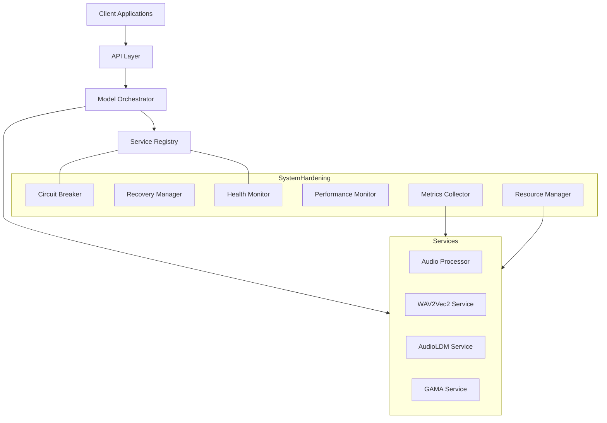
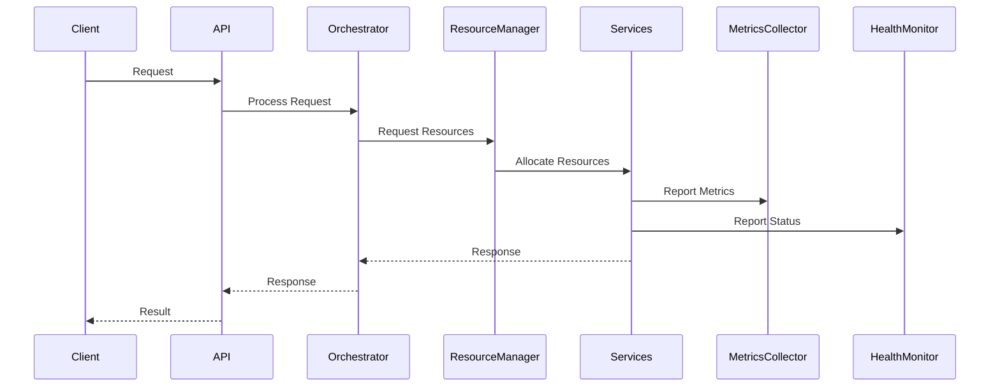
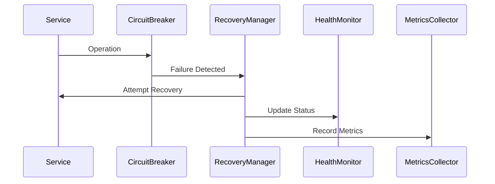

# grym-synth Architecture

## Overview
The grym-synth is built on a robust, scalable architecture that emphasizes reliability, performance, and maintainability. The system integrates multiple specialized components for audio processing, model management, and system stability.

## Core Architecture



## Component Architecture

### 1. System Hardening Layer
- Circuit Breaker Pattern for fault tolerance
- Service Recovery Management
- Health Monitoring System
- Performance Monitoring
- Resource Management
- Metrics Collection

### 2. Core Services
- Service Registry and Lifecycle Management
- Model Orchestration
- Context Management
- Memory Management
- Error Handling

### 3. Audio Processing Services
- Audio Processing Pipeline
- WAV2Vec2 Integration
- AudioLDM Integration
- GAMA Integration
- Pattern Learning

### 4. Resource Management
- Priority-based Allocation
- Automatic Cleanup
- Usage Monitoring
- Health Tracking

## Key Components

### System Hardening
```typescript
interface SystemHardeningConfig {
  enableHealthMonitoring: boolean;
  enablePerformanceMonitoring: boolean;
  enableErrorRecovery: boolean;
  enableResourceManagement: boolean;
  healthCheckIntervalMs?: number;
  performanceCheckIntervalMs?: number;
  maxResourceMemory?: string;
  recoverableServices?: string[];
}
```

### Service Management
```typescript
interface ModelService {
  initialize(): Promise<void>;
  isInitialized(): boolean;
  shutdown(): Promise<void>;
  getStatus(): Promise<ServiceStatus>;
  getMetrics(): Promise<ServiceMetrics>;
  executeTask(task: Task): Promise<TaskResult>;
}
```

### Resource Management
```typescript
interface Resource {
  id: string;
  type: string;
  metadata: Record<string, any>;
  status: 'ready' | 'busy' | 'unavailable';
  createdAt: Date;
  lastUsed: Date;
}
```

## Data Flow

1. Request Handling


2. Error Recovery


## Monitoring & Metrics

### Health Monitoring
- Service status tracking
- Memory usage monitoring
- System-wide health metrics
- Automatic recovery triggers

### Performance Monitoring
- CPU utilization tracking
- Memory usage patterns
- Event loop latency
- Operation metrics

### Resource Monitoring
- Allocation patterns
- Usage efficiency
- Cleanup rates
- Health status

## Error Handling

1. Circuit Breaker Pattern
   - Prevents cascading failures
   - Automatic service isolation
   - Controlled recovery

2. Recovery Management
   - Automated recovery procedures
   - Configurable retry policies
   - Service health tracking

3. Resource Protection
   - Memory limits enforcement
   - Resource cleanup
   - Usage monitoring

## Integration Points

### Internal Integration
- Service Registry integration
- Metrics collection hooks
- Resource management API
- Health check endpoints

### External Integration
- Client API endpoints
- Monitoring interfaces
- Management API
- Metrics export

## Security

1. Resource Protection
   - Access control
   - Resource limits
   - Usage monitoring

2. Service Security
   - Isolation
   - Health verification
   - Error containment

## Configuration

### System Hardening
```yaml
systemHardening:
  healthMonitoring:
    enabled: true
    checkInterval: 30000
  performanceMonitoring:
    enabled: true
    checkInterval: 5000
  errorRecovery:
    enabled: true
    maxAttempts: 3
  resourceManagement:
    enabled: true
    maxMemory: "4GB"
```

### Service Configuration
```yaml
services:
  audioProcessor:
    maxMemory: "2GB"
    recoverable: true
  modelService:
    maxMemory: "4GB"
    recoverable: true
```

## Deployment Considerations

1. Resource Requirements
   - CPU allocation
   - Memory limits
   - Network capacity

2. Monitoring Setup
   - Metrics collection
   - Health checks
   - Performance monitoring

3. Recovery Configuration
   - Circuit breaker settings
   - Recovery policies
   - Resource limits

## Future Extensibility

1. Additional Services
   - Plug-and-play integration
   - Automatic registration
   - Resource management

2. Enhanced Monitoring
   - Custom metrics
   - Advanced analytics
   - Predictive monitoring

3. Resource Optimization
   - Dynamic allocation
   - Predictive scaling
   - Usage optimization

