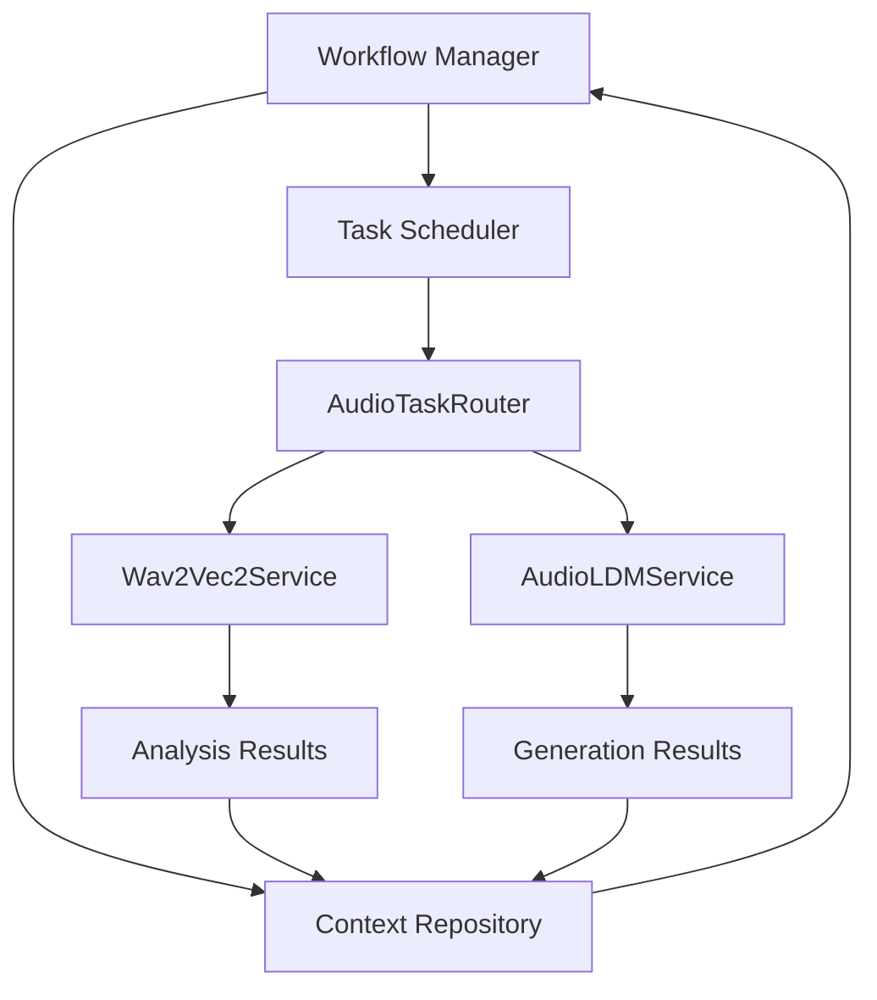

# Automated Workflow Implementation Plan

## Overview

This document outlines the technical implementation plan for adding automated workflow capabilities to the grym-synth. These capabilities will enable an LLM-based "project manager" to orchestrate complex audio processing pipelines without manual intervention.

## Goals

1. Enable automated switching between analysis and generation tasks
2. Support multi-step workflows that combine different audio processing operations
3. Implement feedback loops where analysis results inform generation parameters
4. Create a system for workflow optimization based on results

## Architecture



## Components

### 1. Workflow Definition Schema

```typescript
interface WorkflowStep {
  id: string;
  type: 'analysis' | 'generation' | 'conditional' | 'transformation';
  operation: string;
  inputs: {
    source: 'parameter' | 'previous_step' | 'context';
    key: string;
  }[];
  parameters: Record<string, any>;
  condition?: {
    operator: 'equals' | 'contains' | 'greater_than' | 'less_than';
    leftOperand: string;
    rightOperand: any;
  };
  nextSteps: {
    default?: string;
    conditional?: {
      condition: string;
      stepId: string;
    }[];
  };
}

interface Workflow {
  id: string;
  name: string;
  description: string;
  initialStep: string;
  steps: Record<string, WorkflowStep>;
  parameters: Record<string, any>;
  metadata: {
    createdAt: Date;
    updatedAt: Date;
    createdBy: string;
    version: string;
  };
}
```

### 2. Workflow Manager

The Workflow Manager is responsible for:
- Loading workflow definitions
- Validating workflow structure
- Initializing workflow execution
- Tracking workflow state
- Handling workflow completion and errors

```typescript
class WorkflowManager {
  private workflowRegistry: Map<string, Workflow>;
  private activeWorkflows: Map<string, WorkflowExecution>;
  private contextManager: ContextManager;
  private taskScheduler: TaskScheduler;

  constructor(contextManager: ContextManager, taskScheduler: TaskScheduler) {
    this.workflowRegistry = new Map();
    this.activeWorkflows = new Map();
    this.contextManager = contextManager;
    this.taskScheduler = taskScheduler;
  }

  async registerWorkflow(workflow: Workflow): Promise<void> {
    // Validate workflow structure
    this.validateWorkflow(workflow);
    
    // Store workflow in registry
    this.workflowRegistry.set(workflow.id, workflow);
  }

  async startWorkflow(workflowId: string, parameters: Record<string, any>): Promise<string> {
    // Get workflow definition
    const workflow = this.workflowRegistry.get(workflowId);
    if (!workflow) {
      throw new Error(`Workflow ${workflowId} not found`);
    }
    
    // Create workflow execution
    const executionId = uuidv4();
    const execution = new WorkflowExecution(
      executionId,
      workflow,
      parameters,
      this.contextManager,
      this.taskScheduler
    );
    
    // Store execution
    this.activeWorkflows.set(executionId, execution);
    
    // Start execution
    await execution.start();
    
    return executionId;
  }

  // Additional methods for workflow management
}
```

### 3. Task Scheduler

The Task Scheduler is responsible for:
- Converting workflow steps to tasks
- Scheduling tasks for execution
- Handling task dependencies
- Managing task priorities

```typescript
class TaskScheduler {
  private taskQueue: PriorityQueue<ScheduledTask>;
  private audioTaskRouter: AudioTaskRouter;
  private maxConcurrentTasks: number;
  private runningTasks: Set<string>;

  constructor(audioTaskRouter: AudioTaskRouter, maxConcurrentTasks = 5) {
    this.taskQueue = new PriorityQueue<ScheduledTask>();
    this.audioTaskRouter = audioTaskRouter;
    this.maxConcurrentTasks = maxConcurrentTasks;
    this.runningTasks = new Set();
  }

  async scheduleTask(task: Task, priority: number, dependencies: string[] = []): Promise<string> {
    // Create scheduled task
    const scheduledTask: ScheduledTask = {
      id: uuidv4(),
      task,
      priority,
      dependencies,
      status: 'pending'
    };
    
    // Add to queue
    this.taskQueue.enqueue(scheduledTask, priority);
    
    // Process queue
    this.processQueue();
    
    return scheduledTask.id;
  }

  private async processQueue(): Promise<void> {
    // Check if we can run more tasks
    if (this.runningTasks.size >= this.maxConcurrentTasks) {
      return;
    }
    
    // Get next task
    const nextTask = this.taskQueue.dequeue();
    if (!nextTask) {
      return;
    }
    
    // Check dependencies
    const allDependenciesMet = this.checkDependencies(nextTask);
    if (!allDependenciesMet) {
      // Put back in queue with same priority
      this.taskQueue.enqueue(nextTask, nextTask.priority);
      return;
    }
    
    // Mark as running
    nextTask.status = 'running';
    this.runningTasks.add(nextTask.id);
    
    // Execute task
    try {
      const result = await this.audioTaskRouter.routeTask(nextTask.task);
      nextTask.status = 'completed';
      nextTask.result = result;
    } catch (error) {
      nextTask.status = 'failed';
      nextTask.error = error;
    }
    
    // Remove from running tasks
    this.runningTasks.delete(nextTask.id);
    
    // Process queue again
    this.processQueue();
  }

  // Additional methods for task scheduling
}
```

### 4. Context Adapter Enhancements

Enhance the existing context management system to support workflow-specific context:

```typescript
class WorkflowContextAdapter implements ContextAdapter {
  private contextRepository: ContextRepository;
  
  constructor(contextRepository: ContextRepository) {
    this.contextRepository = contextRepository;
  }
  
  async getContext(filter: ContextFilter, workflowId: string): Promise<ContextItem[]> {
    // Get workflow-specific context
    return this.contextRepository.query({
      ...filter,
      tags: [...(filter.tags || []), `workflow:${workflowId}`]
    });
  }
  
  async storeContext(item: ContextItem, workflowId: string): Promise<void> {
    // Add workflow tag
    const tags = [...(item.tags || []), `workflow:${workflowId}`];
    
    // Store with workflow tag
    await this.contextRepository.store({
      ...item,
      tags
    });
  }
}
```

## Implementation Phases

### Phase 1: Workflow Definition and Execution (2 weeks)

1. Implement the workflow definition schema
2. Create the WorkflowManager class
3. Implement basic workflow validation
4. Create a simple workflow execution engine
5. Add API endpoints for workflow management

### Phase 2: Task Scheduling and Routing (2 weeks)

1. Implement the TaskScheduler class
2. Enhance the AudioTaskRouter to support workflow tasks
3. Add support for task dependencies
4. Implement priority-based scheduling
5. Create monitoring endpoints for task status

### Phase 3: Context Management and Feedback Loops (2 weeks)

1. Enhance the ContextManager to support workflow contexts
2. Implement the WorkflowContextAdapter
3. Create mechanisms for passing context between workflow steps
4. Add support for conditional branching based on results
5. Implement feedback loops for iterative processing

### Phase 4: LLM Integration and Optimization (2 weeks)

1. Create an LLM-friendly API for workflow creation
2. Implement workflow templates for common audio processing pipelines
3. Add support for workflow optimization based on results
4. Create visualization tools for workflow execution
5. Implement workflow versioning and history

## API Endpoints

### Workflow Management

```
POST /api/workflows - Create a new workflow
GET /api/workflows - List all workflows
GET /api/workflows/:id - Get workflow details
PUT /api/workflows/:id - Update workflow
DELETE /api/workflows/:id - Delete workflow
```

### Workflow Execution

```
POST /api/workflows/:id/execute - Execute a workflow
GET /api/executions - List all workflow executions
GET /api/executions/:id - Get execution details
DELETE /api/executions/:id - Cancel execution
```

### Task Management

```
GET /api/tasks - List all tasks
GET /api/tasks/:id - Get task details
GET /api/tasks/:id/status - Get task status
```

## Example Workflow

```json
{
  "id": "audio-enhancement-workflow",
  "name": "Audio Enhancement Workflow",
  "description": "Analyze audio, detect patterns, and generate enhanced version",
  "initialStep": "analyze-audio",
  "steps": {
    "analyze-audio": {
      "id": "analyze-audio",
      "type": "analysis",
      "operation": "patterns",
      "inputs": [
        {
          "source": "parameter",
          "key": "audioFile"
        }
      ],
      "parameters": {},
      "nextSteps": {
        "default": "extract-features"
      }
    },
    "extract-features": {
      "id": "extract-features",
      "type": "analysis",
      "operation": "features",
      "inputs": [
        {
          "source": "parameter",
          "key": "audioFile"
        }
      ],
      "parameters": {},
      "nextSteps": {
        "default": "generate-enhanced"
      }
    },
    "generate-enhanced": {
      "id": "generate-enhanced",
      "type": "generation",
      "operation": "generate",
      "inputs": [
        {
          "source": "previous_step",
          "key": "analyze-audio.result"
        },
        {
          "source": "previous_step",
          "key": "extract-features.result"
        }
      ],
      "parameters": {
        "enhancementLevel": 0.5,
        "preserveOriginalCharacteristics": true
      },
      "nextSteps": {
        "default": "evaluate-result"
      }
    },
    "evaluate-result": {
      "id": "evaluate-result",
      "type": "analysis",
      "operation": "compare",
      "inputs": [
        {
          "source": "parameter",
          "key": "audioFile"
        },
        {
          "source": "previous_step",
          "key": "generate-enhanced.result"
        }
      ],
      "parameters": {},
      "condition": {
        "operator": "greater_than",
        "leftOperand": "result.qualityScore",
        "rightOperand": 0.8
      },
      "nextSteps": {
        "conditional": [
          {
            "condition": "true",
            "stepId": "finalize"
          },
          {
            "condition": "false",
            "stepId": "regenerate"
          }
        ]
      }
    },
    "regenerate": {
      "id": "regenerate",
      "type": "generation",
      "operation": "generate",
      "inputs": [
        {
          "source": "previous_step",
          "key": "analyze-audio.result"
        },
        {
          "source": "previous_step",
          "key": "extract-features.result"
        },
        {
          "source": "previous_step",
          "key": "evaluate-result.result"
        }
      ],
      "parameters": {
        "enhancementLevel": 0.7,
        "preserveOriginalCharacteristics": true,
        "focusAreas": "context.evaluate-result.result.improvementAreas"
      },
      "nextSteps": {
        "default": "evaluate-result"
      }
    },
    "finalize": {
      "id": "finalize",
      "type": "transformation",
      "operation": "export",
      "inputs": [
        {
          "source": "previous_step",
          "key": "generate-enhanced.result"
        }
      ],
      "parameters": {
        "format": "wav",
        "sampleRate": 44100,
        "bitDepth": 16
      },
      "nextSteps": {}
    }
  },
  "parameters": {
    "audioFile": null
  },
  "metadata": {
    "createdAt": "2025-03-02T15:00:00.000Z",
    "updatedAt": "2025-03-02T15:00:00.000Z",
    "createdBy": "system",
    "version": "1.0.0"
  }
}
```

## Conclusion

This implementation plan provides a roadmap for adding automated workflow capabilities to the grym-synth. By following this plan, we will create a system that enables an LLM-based "project manager" to orchestrate complex audio processing pipelines without manual intervention.

The resulting system will support:
- Multi-step workflows combining analysis and generation
- Conditional branching based on results
- Feedback loops for iterative improvement
- Context sharing between workflow steps

These capabilities will form the foundation for more advanced audio processing applications, such as automated music enhancement, audio restoration, and creative audio generation guided by analysis.

