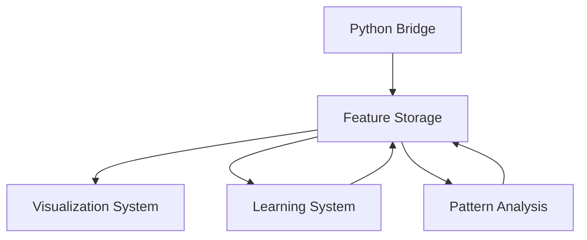

# Implementation Continuity Plan 2025

## Current Foundation (Completed Q1 2025)

### Python Bridge Implementation
Our implemented Python Bridge provides:
- FastAPI-based backend for model inference
- Robust communication layer with circuit breaking
- Health monitoring and error handling
- Wav2Vec2 model integration

### Feature Storage System
The completed storage system delivers:
- Efficient vector storage and retrieval
- Pattern lifecycle management
- Similarity search capabilities
- Persistent storage with monitoring

## Bridge to Future Phases

### Foundation's Role in Next Phases

#### Phase 1: Enhanced Visualization (Q2 2025)
**How Current Implementation Supports:**
- Python Bridge provides real-time pattern detection data
- Feature Storage enables fast pattern retrieval for visualization
- Health monitoring ensures visualization reliability

**Integration Points:**
```typescript
// Example: Pattern visualization using existing infrastructure
class PatternVisualizer {
  constructor(
    private pythonBridge: PythonBridgeService,
    private storage: FeatureStorage
  ) {}

  async visualizePattern(patternId: string) {
    const pattern = await this.storage.getPatternById(patternId);
    const features = await this.pythonBridge.processAudio(
      pattern.audioData,
      'wav2vec2-base'
    );
    return this.renderFeatures(features);
  }
}
```

#### Phase 2: Learning Mechanism (Q2-Q3 2025)
**How Current Implementation Supports:**
- Feature Storage provides pattern persistence layer
- Python Bridge enables model adaptation
- Health monitoring tracks learning performance

**Integration Points:**
```typescript
// Example: Learning system using existing components
class PatternLearningSystem {
  constructor(
    private storage: FeatureStorage,
    private pythonBridge: PythonBridgeService
  ) {}

  async learnFromFeedback(feedback: UserFeedback) {
    const pattern = await this.storage.getPatternById(feedback.patternId);
    const updatedFeatures = await this.pythonBridge.adaptModel(
      pattern,
      feedback
    );
    await this.storage.updatePattern(pattern.id, {
      features: updatedFeatures
    });
  }
}
```

#### Phase 3: Advanced Pattern Analysis (Q3 2025)
**How Current Implementation Supports:**
- Feature Storage enables relationship tracking
- Python Bridge supports complex pattern analysis
- Health monitoring ensures analysis reliability

**Integration Points:**
```typescript
// Example: Pattern relationship analysis using existing systems
class PatternAnalyzer {
  constructor(
    private storage: FeatureStorage,
    private pythonBridge: PythonBridgeService
  ) {}

  async analyzeRelationships(patternIds: string[]) {
    const patterns = await Promise.all(
      patternIds.map(id => this.storage.getPatternById(id))
    );
    return this.pythonBridge.analyzePatternRelationships(patterns);
  }
}
```

## Technical Continuity

### 1. API Evolution
- Current APIs designed for extensibility
- Version compatibility maintained
- Gradual feature introduction
- Backward compatibility assured

### 2. Data Flow Continuity


### 3. Performance Scaling
- Current implementation sets baseline metrics
- Monitoring provides performance data
- Scaling bottlenecks identified
- Optimization opportunities mapped

## Integration Strategy

### Phase 1 Integration
1. Add visualization layer to existing endpoints
2. Extend storage queries for visualization
3. Implement real-time pattern updates
4. Maintain performance metrics

### Phase 2 Integration
1. Add feedback capture to storage system
2. Extend Python Bridge for model adaptation
3. Implement learning persistence
4. Enhance monitoring for learning metrics

### Phase 3 Integration
1. Extend storage for relationship data
2. Add analysis endpoints to Python Bridge
3. Implement pattern evolution tracking
4. Scale monitoring for complex analysis

## Maintaining Quality

### 1. Testing Continuity
- Existing test suites form foundation
- New tests extend current coverage
- Integration tests span phases
- Performance benchmarks maintained

### 2. Documentation Evolution
- Current documentation sets standards
- New features documented consistently
- Cross-phase integration explained
- Example code maintained

### 3. Error Handling
- Current error handling patterns extended
- New error types integrated
- Recovery strategies evolved
- Monitoring enhanced

## Risk Management

### Technical Risks
1. Integration complexity between phases
2. Performance impact of new features
3. Data model evolution challenges

### Mitigation Strategies
1. Modular design with clear interfaces
2. Performance monitoring and optimization
3. Version control and migration paths

## Success Metrics

### Continuity Metrics
- API compatibility: 100%
- Data migration success: 100%
- Performance baseline maintenance
- Error handling coverage

### Integration Metrics
- Cross-phase functionality: 95%
- System reliability: 99.9%
- Feature adoption rate: >80%
- User satisfaction: >90%

## Conclusion

Our completed Python Bridge and Feature Storage System implementation provides a solid foundation for future phases. By maintaining technical continuity and clear integration paths, we ensure smooth evolution of the system while preserving reliability and performance.
