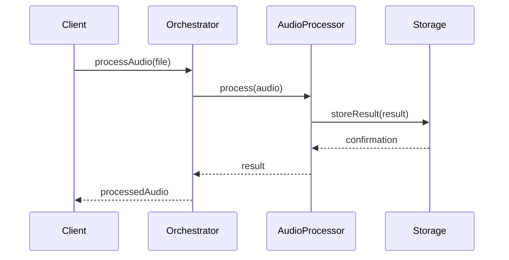
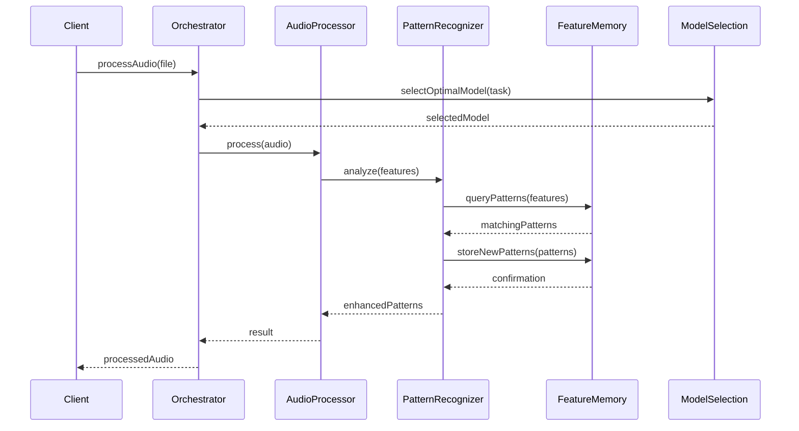

# grym-synth: Hybrid Implementation Plan

## Project Overview
The grym-synth creates an orchestrated system of specialized AI models for music composition, production, and audio software development, coordinated by a central "boss" LLM with sophisticated context sharing and feature memory capabilities.

## Timeline Context
- Project Start: January 2025
- Current Progress: 1 month
- Target MVP: May 2025 (4 months)
- Target Full System: July 2025 (6 months total)

## Current Status

### Completed Core Systems (✓)

1. Resource Management ✓ (Month 1)
   - Memory optimization
   - Context preservation
   - Token management
   - Error handling with improved recovery
   - Resource monitoring with hysteresis
   - Disk caching and persistence
   - Database integration
   - Supabase connection pooling

2. Model Orchestration Core ✓ (Month 1)
   - Task analysis and routing
   - Model coordination with specialized chains
   - Result synthesis and validation
   - Provider integration (Ollama, LM Studio)
   - Enhanced error recovery with fallbacks
   - Resource optimization with dynamic allocation

3. Feature Memory System ✓ (Month 1-2)
   - Pattern recognition engine ✓
   - Persistent storage with optimizations ✓
   - Integration tests complete
   - LRU cache improvements implemented
   - Performance optimization complete
   - Pattern storage fixes completed

4. Health Monitoring System ✓ (Month 1)
   - Stabilization mechanisms
   - Hysteresis implementation
   - Performance optimizations
   - Reduced monitoring overhead
   - Smart retry logic
   - Error rate dampening

5. Testing Infrastructure ✓ (Month 1)
   - Comprehensive test suites
   - Performance testing framework
   - Integration testing tools
   - Resource monitoring tests
   - Cache system verification

6. AudioLDM Integration ✓ (Month 2)
   - Text-to-audio generation capability
   - Memory-optimized implementation for 6GB VRAM
   - Python-TypeScript bridge
   - Service layer integration
   - Context adapter support

## Implementation Philosophy

### MVP-First Approach with Clear Vision
- Begin with minimal viable implementations
- Establish a clear roadmap to the full vision
- Prioritize user value but maintain architectural integrity
- Build incrementally toward the complete system

### Two-Track Development
- **MVP Track**: Focus on essential functionality for early release
- **Vision Track**: Maintain clarity on final system capabilities
- Ensure MVP designs enable smooth path to full vision
- Use actual usage data to refine the vision

## Phased Development Plan

### Phase 1: Core Architecture Completion & MVP Audio (Month 2)

#### MVP Track (Current Focus)
1. **Feature Memory System MVP** (2 weeks)
   - Focus on essentials:
     - Complete basic pattern storage
     - Implement simple caching
     - Ensure core reliability

2. **Audio Processing MVP** (2 weeks)
   - Basic capabilities:
     - Simple wav2vec2 integration
     - Essential audio analysis
     - Basic pattern recognition

#### Vision Track (Parallel Planning)
- Document detailed architecture for advanced features
- Create technical specifications for full implementation
- Define interfaces for future components
- Maintain alignment with current implementation

### Phase 2: First User-Facing Tools (Months 3-4)

#### MVP Track
1. **Music Composition Basic Tools** (3 weeks)
   - Essential functionality:
     - Basic composition assistance
     - Style guidance templates
     - Simple pattern application

2. **Audio Production Core Features** (3 weeks)
   - Key capabilities:
     - Basic mixing recommendations
     - Simple effect suggestions
     - Essential audio analysis

3. **Initial Workflow Integration** (2 weeks)
   - Core integration:
     - Simple end-to-end process
     - Basic context sharing
     - Essential UI components

#### Vision Track
- Define enhanced composition capabilities
- Design advanced audio processing patterns
- Plan sophisticated context sharing mechanisms
- Create specifications for full feature set

### Phase 3: MVP Release & Enhanced Features (Months 4-5)

#### MVP Track
1. **MVP System Release** (2 weeks)
   - Finalize core functionality:
     - Complete essential workflows
     - Ensure reliable operation
     - Polish user experience
     - Gather user feedback

2. **Audio Model Enhancements** (4 weeks)
   - Targeted improvements based on feedback:
     - Refine audio processing
     - Integrate GAMA if available
     - Address user-identified issues

#### Vision Track
- Refine vision based on user feedback
- Update specifications for advanced features
- Adjust architectural plans based on usage patterns
- Prioritize full-system features based on user needs

### Phase 4: Full System Implementation (Months 5-6)

#### Advanced Features Implementation
1. **Enhanced Context Management** (2 weeks)
   - Full implementation:
     - Specialized audio context adapters
     - Multi-modal context processing
     - Audio-specific feature memory
     - Performance optimization for audio

2. **Advanced Pattern Recognition** (2 weeks)
   - Complete system:
     - Sophisticated audio pattern recognition
     - Musical style pattern detection
     - Composition pattern memory
     - Learning from usage patterns

3. **System Optimization & Scaling** (2 weeks)
   - Production readiness:
     - Performance tuning
     - Scaling capabilities
     - Enhanced monitoring
     - Production deployment

## Detailed Component Specifications

### Audio Processing System

#### MVP Implementation
```typescript
// MVP Audio Processing Interface
interface AudioProcessorMVP {
  process(audio: AudioBuffer): Promise<ProcessedAudio>;
  analyze(audio: AudioBuffer): Promise<BasicFeatures>;
}
```

#### Full Vision Implementation
```typescript
// Full Audio Processing Interface
interface AudioProcessor {
  process(audio: AudioBuffer): Promise<ProcessedAudio>;
  analyze(audio: AudioBuffer): Promise<AudioFeatures>;
  enhance(audio: AudioBuffer, parameters?: EnhancementParams): Promise<EnhancedAudio>;
  classifyStyle(audio: AudioBuffer): Promise<StyleClassification>;
  detectPatterns(audio: AudioBuffer): Promise<AudioPatterns>;
}
```

### Pattern Recognition System

#### MVP Implementation
```typescript
// MVP Pattern Recognition
interface PatternRecognizerMVP {
  detectBasicPatterns(features: BasicFeatures): Promise<BasicPatterns>;
  storePattern(pattern: BasicPattern): Promise<void>;
}
```

#### Full Vision Implementation
```typescript
// Full Pattern Recognition
interface PatternRecognizer {
  detectPatterns(features: AudioFeatures): Promise<AudioPatterns>;
  learnPatterns(patterns: AudioPatterns): Promise<void>;
  getRelatedPatterns(pattern: AudioPattern): Promise<RelatedPatterns>;
  classifyPattern(pattern: AudioPattern): Promise<PatternClassification>;
  findSimilarPatterns(pattern: AudioPattern, threshold?: number): Promise<SimilarPatterns>;
}
```

### Model Orchestration System

#### MVP Implementation
```typescript
// MVP Orchestration
interface ModelOrchestratorMVP {
  routeTask(task: BasicTask): Promise<SimpleChain>;
  executeChain(chain: SimpleChain): Promise<BasicResult>;
}
```

#### Full Vision Implementation
```typescript
// Full Orchestration
interface ModelOrchestrator {
  routeTask(task: AudioTask): Promise<ModelChain>;
  executeChain(chain: ModelChain): Promise<ProcessingResult>;
  optimizeExecution(metrics: PerformanceMetrics): Promise<void>;
  handleErrors(error: ProcessingError): Promise<RecoveryStrategy>;
  balanceResources(demands: ResourceDemands): Promise<ResourceAllocation>;
}
```

## Critical Workflows

### Audio Processing Flow

#### MVP Flow


#### Full Vision Flow


## Risk Management

### Technical Risks

#### Model Integration Risks
- **Risk**: GAMA model availability and integration challenges
- **MVP Mitigation**: Use wav2vec2 as primary model
- **Full Vision Approach**: Create abstraction layer for seamless model switching

#### Performance Risks
- **Risk**: Audio processing latency exceeding targets
- **MVP Mitigation**: Simpler processing with acceptable latency
- **Full Vision Approach**: Advanced optimizations and streaming processing

#### Resource Usage Risks
- **Risk**: Memory consumption exceeding limits
- **MVP Mitigation**: Basic memory management
- **Full Vision Approach**: Sophisticated memory optimization, sharded caching

## Success Metrics

### MVP Metrics (Month 4)
- Audio processing: < 500ms for basic operations
- Pattern recognition: < 200ms
- Storage operations: < 50ms
- System reliability: > 95% uptime
- User satisfaction: > 75%

### Full System Metrics (Month 6)
- Audio processing: < 200ms for complex operations
- Pattern recognition: < 50ms avg, < 100ms P95
- Storage operations: < 20ms avg, < 50ms P95
- System reliability: > 99.5%
- User satisfaction: > 90%

## Implementation Priorities

### Immediate Next Steps

1. **Create Simple Web Interface** (2 weeks)
   - Implement minimal UI for demonstrating both audio analysis and generation
   - Create visualizations of audio patterns and generation results
   - Enable parameter adjustment for generation

2. **Implement Bidirectional Workflows** (2 weeks)
   - Connect analysis (wav2vec2) and generation (AudioLDM) capabilities
   - Enable patterns from analysis to inform generation
   - Create end-to-end test cases for complete workflows

## Conclusion

This hybrid implementation plan allows us to:
1. Deliver an MVP system quickly (by Month 4)
2. Maintain clarity on the full vision
3. Avoid over-engineering early versions
4. Create a clear path from MVP to complete system

By maintaining both the MVP track and the vision track in parallel, we ensure that our immediate implementation decisions are compatible with our long-term architectural goals while still prioritizing early delivery of user value.

