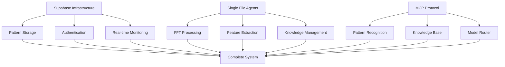

# Integration Status Report - Q1 2025

## Technology Stack Integration Status

### 1. Supabase Infrastructure (🔄 Planning)
- **Current Status**: Not integrated
- **Priority**: High - Critical for infrastructure foundation
- **Initial Tasks**:
  - [ ] Create Supabase project setup documentation
  - [ ] Design database schema for pattern storage
  - [ ] Plan authentication integration
  - [ ] Design real-time monitoring tables

### 2. Single File Agents (UV) (⚠️ Not Started)
- **Current Status**: Research phase
- **Priority**: Medium - Will follow Supabase integration
- **Initial Tasks**:
  - [ ] Document UV installation process
  - [ ] Design core agent structure
  - [ ] Plan agent communication patterns
  - [ ] Define resource monitoring integration

### 3. Model Context Protocol (MCP) (🔄 In Progress)
- **Current Status**: Initial implementation started
- **Priority**: High - Critical for LLM orchestration
- **Initial Tasks**:
  - [x] Basic MCP server template created
  - [ ] Design pattern recognition service
  - [ ] Plan knowledge base service
  - [ ] Implement model router service

## Integration Dependencies



## Implementation Priorities

### Phase 1: Foundation (Current)
1. **Supabase Setup**
   - Create project infrastructure
   - Implement basic schema
   - Set up authentication
   - Configure real-time features

2. **MCP Protocol Integration**
   - Complete base server implementation
   - Add core services
   - Implement health monitoring
   - Test basic functionality

### Phase 2: Agent Layer
1. **UV Integration**
   - Set up UV environment
   - Create agent templates
   - Implement communication patterns
   - Add resource monitoring

2. **Core Agents**
   - Pattern processing
   - Feature extraction
   - Knowledge management
   - Model routing

### Phase 3: System Connection
1. **Cross-System Communication**
   - Supabase-MCP integration
   - Agent-MCP communication
   - Supabase-Agent data flow

2. **Monitoring & Management**
   - Health monitoring
   - Resource tracking
   - Performance metrics
   - System analytics

## Technical Considerations

### Supabase Implementation
```typescript
interface PatternStorage {
  // Pattern storage structure
  patterns: {
    id: string
    data: JSON
    metadata: JSON
    created_at: timestamp
    updated_at: timestamp
  }
  
  // Real-time monitoring
  monitoring: {
    system_health: JSON
    resource_usage: JSON
    last_updated: timestamp
  }
}
```

### MCP Server Structure
```typescript
interface MCPServices {
  patternRecognition: {
    analyze: (data: FFTData) => Promise<Pattern>
    validate: (pattern: Pattern) => Promise<boolean>
  }
  
  knowledgeBase: {
    store: (knowledge: Knowledge) => Promise<void>
    retrieve: (query: Query) => Promise<Knowledge>
  }
  
  modelRouter: {
    route: (task: Task) => Promise<Model>
    monitor: (modelId: string) => Promise<Health>
  }
}
```

### UV Agent Template
```python
from mcp.server import FastMCP
from supabase import create_client

class AudioAgent:
    def __init__(self):
        self.mcp = FastMCP("audio-processor")
        self.supabase = create_client(url, key)
        
    async def process_pattern(self, fft_data):
        # Pattern processing implementation
        pass
        
    async def store_result(self, pattern):
        # Supabase storage implementation
        pass
```

## Next Steps

1. **Immediate Actions**
   - Set up Supabase project
   - Complete MCP server foundation
   - Design initial agent structure

2. **Documentation Needs**
   - Supabase schema documentation
   - MCP service specifications
   - Agent communication protocols
   - Integration test plans

3. **Technical Requirements**
   - Supabase connection details
   - MCP server configuration
   - UV environment setup
   - Monitoring requirements

## Risk Assessment

### Technical Risks
1. **Integration Complexity**
   - Multiple system coordination
   - Data consistency across systems
   - Performance overhead

2. **Performance Impacts**
   - Real-time monitoring load
   - Pattern storage scalability
   - Agent resource usage

### Mitigation Strategies
1. **System Design**
   - Clear separation of concerns
   - Efficient data flow patterns
   - Robust error handling

2. **Implementation Approach**
   - Phased rollout
   - Comprehensive testing
   - Performance benchmarking
   - Monitoring integration

## Success Metrics

1. **Integration Metrics**
   - System response time < 100ms
   - Data consistency > 99.9%
   - Real-time sync < 50ms

2. **Performance Metrics**
   - Pattern processing < 50ms
   - Storage operations < 20ms
   - Agent overhead < 5%

3. **Reliability Metrics**
   - System uptime > 99.9%
   - Error rate < 0.1%
   - Recovery time < 1s
