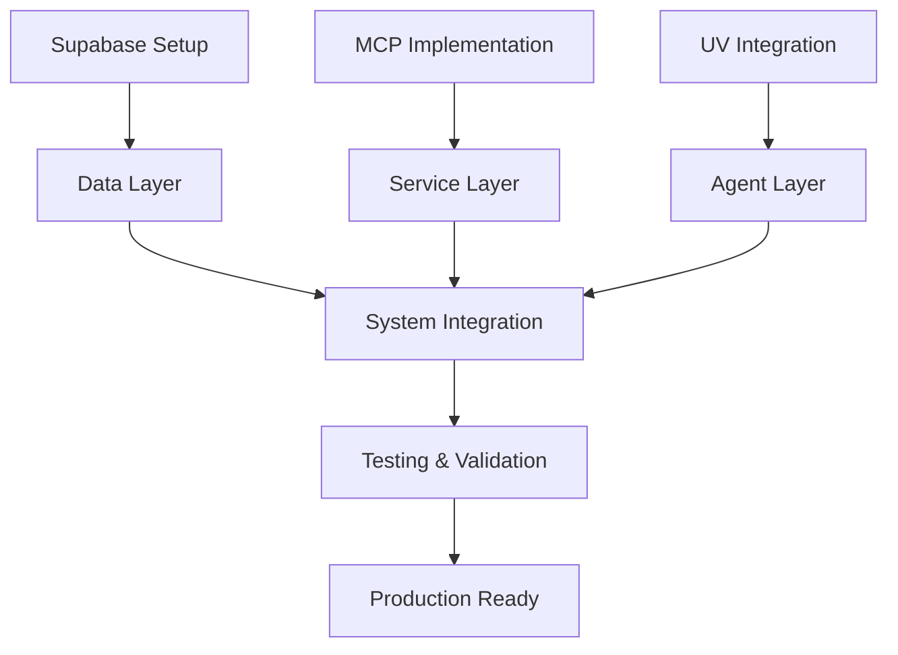

# Integration Summary & Next Steps

## Current Progress

### Documentation Completed
1. ✅ Integration Status Report (Q1 2025)
   - Technology stack assessment
   - Current implementation status
   - Integration dependencies
   - Risk assessment

2. ✅ Implementation Tasks
   - Detailed task breakdown
   - Timeline estimates
   - Success criteria
   - Resource requirements

3. ✅ MCP Server Design
   - Core components
   - Integration points
   - Security configuration
   - Health monitoring

### Infrastructure Components

1. **Supabase Integration** (Not Started)
   - Foundation for persistent storage
   - Real-time monitoring backbone
   - Authentication and authorization
   - Status: Planning Phase

2. **UV/Single File Agents** (Research Phase)
   - Agent architecture defined
   - Template structure designed
   - Integration points identified
   - Status: Design Phase

3. **MCP Protocol** (In Progress)
   - Server design completed
   - Core interfaces defined
   - Integration patterns documented
   - Status: Initial Implementation

## Immediate Action Items

### Week 1 (Current)
1. Supabase Setup
   - [ ] Create project
   - [ ] Set up development environment
   - [ ] Define initial schema
   - [ ] Configure authentication

2. MCP Implementation
   - [ ] Initialize base server
   - [ ] Set up core endpoints
   - [ ] Configure monitoring
   - [ ] Test basic connectivity

3. Documentation
   - [ ] Create setup guides
   - [ ] Document configuration
   - [ ] Write integration tests
   - [ ] Update architecture docs

### Week 2 (Next)
1. UV Integration
   - [ ] Set up UV environment
   - [ ] Create agent templates
   - [ ] Test agent communication
   - [ ] Document agent patterns

2. Cross-System Integration
   - [ ] Implement Supabase-MCP connection
   - [ ] Set up basic agent communication
   - [ ] Test data flow
   - [ ] Monitor performance

## Critical Path

## Risk Management

### Current Risks
1. **Integration Complexity**
   - Multiple system coordination
   - Cross-system communication
   - State management

2. **Performance Overhead**
   - Inter-system latency
   - Resource usage
   - Data synchronization

3. **Technical Debt**
   - Initial implementation speed vs. quality
   - Documentation maintenance
   - Testing coverage

### Mitigation Strategies
1. **Phased Implementation**
   - Start with core functionality
   - Validate each integration
   - Regular performance testing

2. **Clear Documentation**
   - Maintain design docs
   - Update integration guides
   - Document decisions

3. **Strong Testing**
   - Integration tests
   - Performance benchmarks
   - Security validation

## Success Criteria

### Phase 1 (Weeks 1-3)
- Basic Supabase integration working
- MCP server handling requests
- Initial UV agents running
- Core documentation complete

### Phase 2 (Weeks 4-6)
- Cross-system communication working
- Data flowing between components
- Monitoring in place
- Integration tests passing

### Phase 3 (Weeks 7-9)
- Full feature set implemented
- Performance targets met
- Security validated
- Production ready

## Resource Requirements

### Development
- Supabase account and credentials
- UV development environment
- MCP protocol documentation
- Testing infrastructure

### Documentation
- Integration guides
- API documentation
- Configuration guides
- Testing procedures

### Monitoring
- Performance metrics
- Error tracking
- Resource usage
- Health monitoring

## Next Steps

1. **Immediate**
   - Begin Supabase setup
   - Start MCP server implementation
   - Initialize UV environment

2. **This Week**
   - Complete core setup
   - Begin integration testing
   - Update documentation

3. **Next Week**
   - Implement cross-system communication
   - Add monitoring
   - Begin feature implementation

4. **Long Term**
   - Complete full integration
   - Optimize performance
   - Prepare for production
