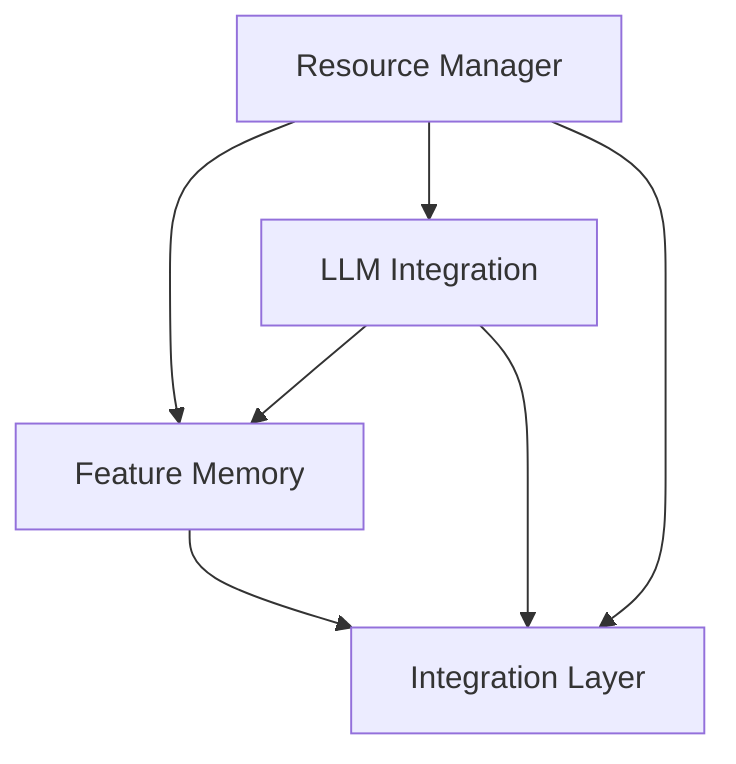

# Integration Testing Plan

## Overview
This document outlines the comprehensive integration testing strategy for the grym-synth, focusing on how different components interact and work together.

## Component Dependencies



## Test Hierarchy

### 1. Core Components
- Resource Manager (Completed)
  * Memory management ✓
  * Resource monitoring ✓
  * Disk caching ✓
  * Error handling ✓

### 2. LLM Integration (Phase 1)
- Provider switching
- Context preservation
- Error propagation
- Resource allocation

### 3. Feature Memory (Phase 2)
- Learning patterns
- Optimization storage
- Cross-model optimization
- Knowledge transfer

### 4. End-to-End Workflows (Phase 3)
- Multi-LLM scenarios
- Knowledge sharing
- System optimization
- Error recovery

## Integration Test Scenarios

### 1. Provider Switching with Memory
```typescript
describe('Provider Switching with Memory', () => {
  it('should maintain learning patterns during provider switch', async () => {
    // Test pattern preservation during switch
  });

  it('should optimize resources across providers', async () => {
    // Test resource optimization
  });
});
```

### 2. Cross-Component Learning
```typescript
describe('Cross-Component Learning', () => {
  it('should share optimizations between components', async () => {
    // Test optimization sharing
  });

  it('should maintain system stability during learning', async () => {
    // Test system stability
  });
});
```

### 3. Error Recovery Chains
```typescript
describe('Error Recovery Chains', () => {
  it('should handle cascading errors', async () => {
    // Test error propagation
  });

  it('should maintain data consistency during recovery', async () => {
    // Test recovery consistency
  });
});
```

## Test Dependencies

### Resource Manager Dependencies
- Memory compression
- Disk caching
- Error handling
- Resource monitoring

### LLM Integration Dependencies
- Provider management
- Context handling
- Resource allocation
- Error propagation

### Feature Memory Dependencies
- Pattern recognition
- Optimization storage
- Knowledge transfer
- Resource utilization

## Integration Points

### 1. Resource Management Layer
```typescript
interface ResourceIntegration {
  allocateResources(request: ResourceRequest): Promise<ResourceAllocation>;
  optimizeUsage(context: Context): Promise<OptimizationResult>;
  handleFailure(error: Error): Promise<RecoveryResult>;
}
```

### 2. LLM Provider Layer
```typescript
interface ProviderIntegration {
  switchProvider(context: Context, newProvider: Provider): Promise<void>;
  preserveState(context: Context): Promise<ContextState>;
  restoreState(state: ContextState): Promise<void>;
}
```

### 3. Feature Memory Layer
```typescript
interface MemoryIntegration {
  shareKnowledge(source: Context, target: Context): Promise<void>;
  optimizePatterns(context: Context): Promise<OptimizationResult>;
  persistLearning(patterns: LearningPattern[]): Promise<void>;
}
```

## Test Execution Order

1. Core Component Tests
   - Resource management tests
   - Basic functionality tests
   - Error handling tests

2. Integration Layer Tests
   - Provider switching tests
   - Memory preservation tests
   - Resource optimization tests

3. End-to-End Tests
   - Complete workflow tests
   - Performance tests
   - Stability tests

## Success Criteria

### Resource Management
- Efficient resource allocation
- Proper cleanup
- Error recovery
- Performance optimization

### LLM Integration
- Seamless provider switching
- Context preservation
- Error handling
- Resource efficiency

### Feature Memory
- Pattern recognition
- Knowledge transfer
- Optimization effectiveness
- Resource utilization

### Overall System
- Stability under load
- Error recovery
- Performance metrics
- Resource efficiency

## Test Implementation Strategy

### Phase 1: Core Integration
1. Implement basic integration tests
2. Verify component interactions
3. Test resource management
4. Validate error handling

### Phase 2: Advanced Features
1. Add provider switching tests
2. Implement memory tests
3. Test optimization features
4. Verify knowledge transfer

### Phase 3: End-to-End Testing
1. Create complete workflow tests
2. Add performance tests
3. Implement stability tests
4. Verify system recovery

## Related Documentation
- [LLM Integration Testing](./LLM-INTEGRATION-TESTING.md)
- [Feature Memory Testing](./FEATURE-MEMORY-TESTING.md)
- [Resource Management Guide](./RESOURCE-MANAGER-GUIDE.md)

