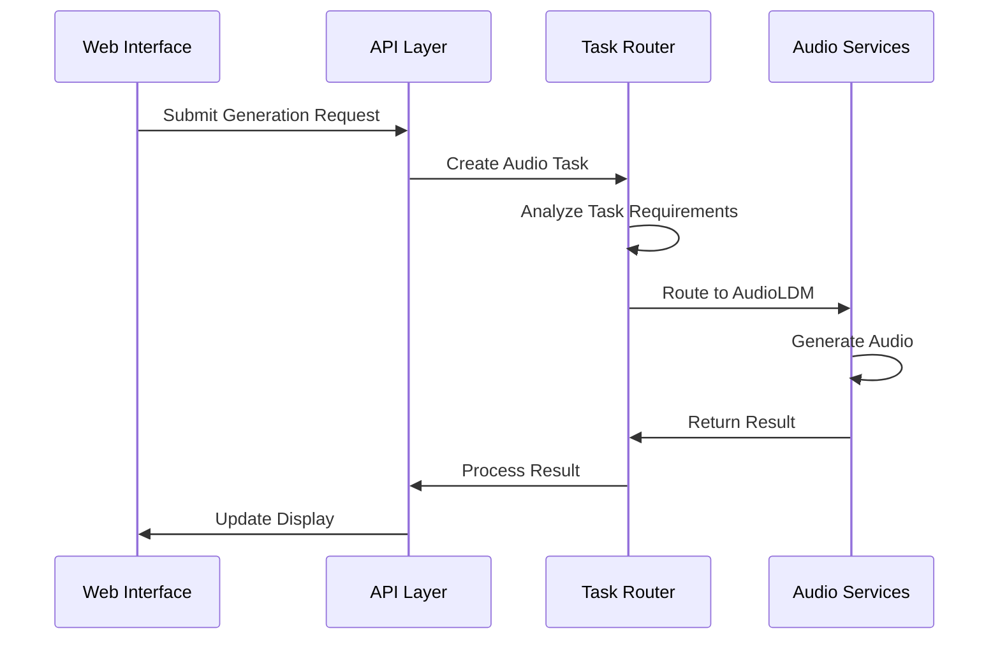

# grym-synth: Iteration Specifications

This document provides technical specifications for the immediate next steps in the iterative development plan.

## 1. Testing and Optimization (Iteration 1)

### Performance Testing Framework

```typescript
interface AudioLDMPerformanceMetrics {
  initializationTime: number;
  memoryUsage: {
    initial: number;
    peak: number;
    stable: number;
  };
  generationMetrics: {
    averageGenerationTime: number;
    peakMemoryDuringGeneration: number;
    promptComplexityScore: number;
  };
  modelMetrics: {
    quantizationLevel: '8bit' | '4bit' | 'none';
    diffusionSteps: number;
    batchSize: number;
    useHalfPrecision: boolean;
  };
}

interface PerformanceTestSuite {
  runInitializationTest(): Promise<{
    success: boolean;
    metrics: Pick<AudioLDMPerformanceMetrics, 'initializationTime' | 'memoryUsage'>;
  }>;
  
  runGenerationTest(params: {
    prompt: string;
    duration: number;
    diffusionSteps: number;
  }): Promise<{
    success: boolean;
    metrics: AudioLDMPerformanceMetrics['generationMetrics'];
  }>;
  
  runStressTest(params: {
    iterations: number;
    concurrent: number;
  }): Promise<{
    success: boolean;
    metrics: Array<AudioLDMPerformanceMetrics>;
  }>;
}
```

### Memory Monitoring

```typescript
interface MemoryProfile {
  timestamp: number;
  totalMemory: number;
  freeMemory: number;
  gpuMemory?: {
    total: number;
    used: number;
    free: number;
  };
  processMemory: {
    heapTotal: number;
    heapUsed: number;
    external: number;
  };
}

interface MemoryMonitor {
  startTracking(label: string): void;
  snapshot(): MemoryProfile;
  endTracking(label: string): {
    duration: number;
    startProfile: MemoryProfile;
    endProfile: MemoryProfile;
    peakProfile: MemoryProfile;
  };
  getAverageUsage(timeWindow: number): MemoryProfile;
  setWarningThreshold(threshold: number): void;
  setErrorThreshold(threshold: number): void;
}
```

## 2. Integration with Orchestration Layer (Iteration 1)

### Task Router

```typescript
interface AudioTask {
  type: 'analysis' | 'generation';
  priority: number;
  requirements: {
    memory: number;
    computeIntensity: number;
    expectedDuration: number;
  };
  input: {
    audio?: Float32Array;
    prompt?: string;
    parameters?: Record<string, any>;
  };
}

interface TaskRouter {
  analyzeTask(task: AudioTask): {
    serviceType: 'wav2vec2' | 'audioldm';
    priority: number;
    estimatedResources: {
      memory: number;
      computeTime: number;
    };
  };

  routeTask(task: AudioTask): Promise<{
    service: ModelService;
    taskConfig: Record<string, any>;
  }>;

  balanceLoad(currentTasks: AudioTask[]): {
    taskPriorities: Record<string, number>;
    resourceAllocations: Record<string, number>;
  };
}
```

### Service Handoff

```typescript
interface ServiceBridge {
  transferContext(
    fromService: string,
    toService: string,
    context: Record<string, any>
  ): Promise<void>;

  validateHandoff(
    fromService: string,
    toService: string,
    task: AudioTask
  ): Promise<{
    valid: boolean;
    issues?: string[];
  }>;

  executeHandoff(
    fromService: string,
    toService: string,
    task: AudioTask,
    intermediateResults?: any
  ): Promise<void>;
}
```

## 3. User Experience Layer (Iteration 1)

### Web Interface Components

```typescript
interface AudioControls {
  file: File | null;
  playing: boolean;
  currentTime: number;
  duration: number;
  volume: number;
  
  load(file: File): Promise<void>;
  play(): void;
  pause(): void;
  seek(time: number): void;
  setVolume(value: number): void;
}

interface GenerationForm {
  prompt: string;
  parameters: {
    duration: number;
    diffusionSteps: number;
    guidanceScale: number;
    seed?: number;
  };
  
  validate(): boolean;
  submit(): Promise<void>;
  reset(): void;
  updateParameter(key: string, value: any): void;
}

interface ResultsDisplay {
  audioResult: {
    audio: Float32Array;
    sampleRate: number;
    duration: number;
  } | null;
  
  metrics: {
    generationTime: number;
    memoryUsed: number;
    modelParameters: Record<string, any>;
  };
  
  status: 'idle' | 'generating' | 'success' | 'error';
  error?: string;
  
  displayAudio(): void;
  displayMetrics(): void;
  clear(): void;
}
```

### API Interface

```typescript
interface AudioAPI {
  generateAudio(params: {
    prompt: string;
    duration: number;
    parameters: Record<string, any>;
  }): Promise<{
    audio: Float32Array;
    sampleRate: number;
    duration: number;
    metrics: Record<string, any>;
  }>;

  analyzeAudio(audio: Float32Array, sampleRate: number): Promise<{
    features: Record<string, any>;
    patterns: Record<string, any>;
    metrics: Record<string, any>;
  }>;

  getServiceStatus(): Promise<{
    wav2vec2: boolean;
    audioldm: boolean;
    memory: Record<string, number>;
  }>;
}
```

## Component Integration



## Success Criteria

### Performance Targets
- Model initialization: < 5 seconds
- Memory usage: < 6GB VRAM
- Generation time: < 10 seconds for 5-second audio
- UI responsiveness: < 100ms for controls

### Quality Metrics
- Audio quality: > 16kHz sample rate
- Generation success rate: > 95%
- UI feedback latency: < 50ms
- Error handling coverage: 100% of known error cases

### Implementation Checklist
- [ ] Performance testing framework implementation
- [ ] Memory monitoring integration
- [ ] Task routing system
- [ ] Service handoff mechanism
- [ ] Basic web interface
- [ ] API layer implementation
- [ ] Error handling and recovery
- [ ] Documentation updates

