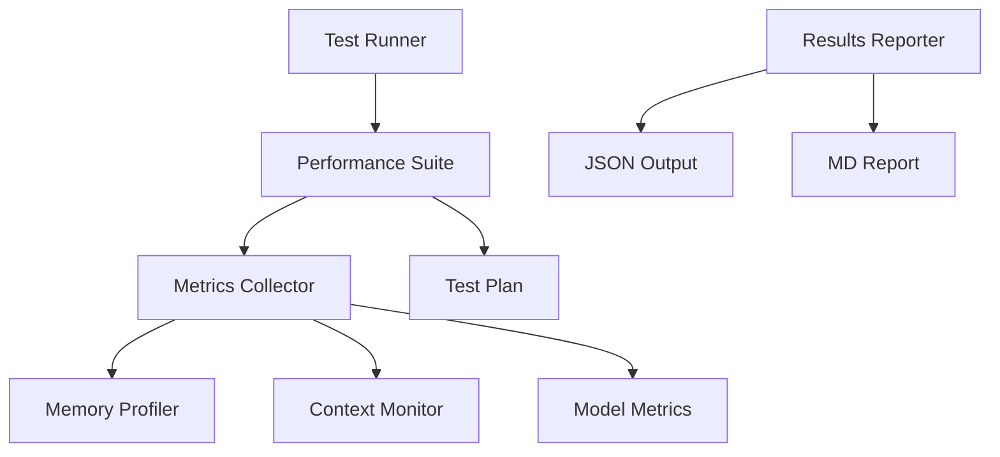

# Performance Testing Architecture

## System Overview

The performance testing infrastructure consists of several key components working together to measure, analyze, and report on the system's performance characteristics.



## Core Components

### 1. Test Runner (`test-runner.ts`)
- Orchestrates the entire test execution
- Manages test lifecycle and resources
- Handles output directory creation
- Coordinates between components
- Implements CLI interface

```typescript
interface TestRunner {
  runTests(): Promise<{
    results: TestResults;
    report: TestReport;
  }>;
  cleanup(): Promise<void>;
}
```

### 2. Performance Suite (`performance-suite.ts`)
- Implements core test scenarios
- Manages test state
- Coordinates with metrics collector
- Handles test phase transitions

```typescript
interface PerformanceSuite {
  runBaseline(): Promise<BaselineMetrics>;
  testCrossModelInteractions(): Promise<CrossModelMetrics>;
  profileMemoryUsage(): Promise<MemoryProfile>;
}
```

### 3. Metrics Collector (`metrics-collector.ts`)
- Collects and aggregates metrics
- Implements sampling strategies
- Manages metric persistence
- Provides real-time monitoring

```typescript
interface MetricsCollector {
  startCollection(): void;
  collectMetrics(duration: number): Promise<Metrics>;
  stopCollection(): void;
}
```

### 4. Test Plan (`test-plan.ts`)
- Defines test phases and scenarios
- Specifies success criteria
- Manages test configuration
- Handles phase transitions

```typescript
interface TestPlan {
  phases: TestPhase[];
  runAll(): Promise<PhaseResult[]>;
  validateResults(results: Metrics): boolean;
}
```

## Implementation Strategy

### Phase 1: Core Infrastructure

1. **Metrics Collection System**
   - Implement base metrics collector
   - Add memory profiling
   - Add timing measurements
   - Implement sampling system

2. **Test Runner Framework**
   - Setup CLI interface
   - Implement resource management
   - Add output handling
   - Setup cleanup routines

3. **Basic Test Suite**
   - Implement baseline tests
   - Add basic model operations
   - Setup test lifecycle hooks
   - Add error handling

### Phase 2: Advanced Features

1. **Cross-Model Testing**
   - Implement model switching
   - Add context preservation
   - Measure transition times
   - Monitor resource usage

2. **Load Testing**
   - Add concurrent request handling
   - Implement stability monitoring
   - Add error rate tracking
   - Setup resource limits

3. **Reporting System**
   - Implement JSON output
   - Add markdown report generation
   - Setup metrics visualization
   - Add trend analysis

## Success Criteria

### Baseline Performance
- Memory usage < 14GB
- Response time < 1s
- Context preservation > 95%

### Cross-Model Performance
- Switch time < 2s
- Context accuracy > 90%
- Memory growth < 100MB

### System Stability
- Concurrent requests: 10
- System stability > 99%
- Error rate < 1%

## Error Handling

### Strategy
1. **Graceful Degradation**
   - Capture and log errors
   - Continue testing where possible
   - Report partial results

2. **Resource Protection**
   - Monitor system resources
   - Implement safety thresholds
   - Auto-cleanup on failure

3. **Data Preservation**
   - Save intermediate results
   - Implement checkpoint system
   - Enable test resumption

## Monitoring & Reporting

### Real-time Monitoring
- Memory usage tracking
- Response time monitoring
- Error rate observation
- Resource utilization

### Results Processing
- Metrics aggregation
- Statistical analysis
- Threshold validation
- Trend detection

### Report Generation
- JSON results file
- Markdown summary
- Performance graphs
- Failure analysis

## Future Enhancements

### Planned Improvements
1. Continuous monitoring integration
2. Automated regression detection
3. Extended multi-model scenarios
4. Custom metric plugins
5. Cloud resource monitoring

### Integration Points
1. CI/CD pipeline integration
2. Monitoring system hooks
3. Alert system integration
4. Dashboard integration

## Development Guidelines

### Adding New Tests
1. Define test phase interface
2. Implement metrics collection
3. Add success criteria
4. Update test runner
5. Add documentation

### Modifying Thresholds
1. Update test plan configuration
2. Adjust success criteria
3. Update documentation
4. Verify changes

### Best Practices
1. Regular test execution
2. Representative test data
3. Consistent environment
4. Clean state between runs
5. Comprehensive logging
