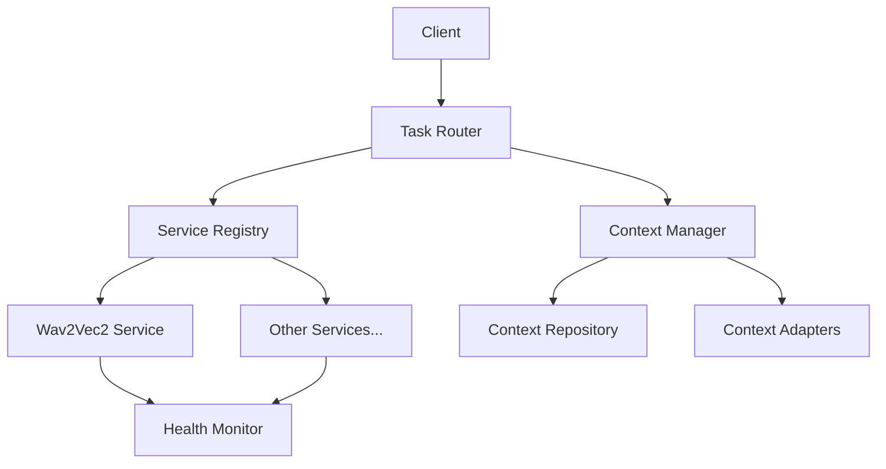

# Service Layer & Context Management Implementation

## Overview

This document details the implementation of two critical systems in the grym-synth:

1. A persistent service layer for managing model lifecycles
2. A context management system for sharing information between models

## Architecture



## Service Layer Implementation

### Core Components

1. **ModelService Interface**
   ```typescript
   interface ModelService {
     initialize(): Promise<void>;
     isInitialized(): boolean;
     shutdown(): Promise<void>;
     getStatus(): Promise<ServiceStatus>;
     getMetrics(): Promise<ServiceMetrics>;
     executeTask(task: Task): Promise<TaskResult>;
   }
   ```

2. **Service Registry**
   - Centralized service management
   - Handles service lifecycle (initialization, shutdown)
   - Lazy initialization on first use
   - Service discovery capabilities

3. **Service Factory**
   - Creates properly configured service instances
   - Handles default configurations
   - Validates service configurations
   - Supports dependency injection

4. **Health Monitoring**
   - Real-time service status tracking
   - Performance metrics collection
   - Automatic recovery mechanisms
   - Resource usage monitoring

### Key Features

- **Lifecycle Management**
  - Proper initialization sequence
  - Graceful shutdown
  - Resource cleanup
  - State management

- **Error Handling**
  - Comprehensive error types
  - Graceful degradation
  - Recovery mechanisms
  - Detailed error reporting

- **Metrics Collection**
  - Request counts
  - Processing times
  - Memory usage
  - Error rates

## Context Management System

### Core Components

1. **Context Repository**
   ```typescript
   interface ContextRepository {
     store(item: ContextItem): Promise<void>;
     retrieve(id: string): Promise<ContextItem>;
     query(filter: ContextFilter): Promise<ContextItem[]>;
     update(id: string, updates: Partial<ContextItem>): Promise<void>;
     delete(id: string): Promise<void>;
   }
   ```

2. **Context Manager**
   - Centralized context handling
   - Context adaptation for different models
   - Priority-based context filtering
   - TTL management

3. **Context Adapters**
   - Model-specific context transformation
   - Context validation
   - Data format conversion
   - Optimization for specific model types

### Features

- **Context Storage**
  - In-memory storage with persistence options
  - Efficient querying capabilities
  - Automatic cleanup of stale context
  - Thread-safe operations

- **Context Adaptation**
  - Model-specific transformations
  - Format validation
  - Data optimization
  - Context merging

- **Priority Management**
  - Context prioritization
  - TTL-based expiration
  - Resource-aware storage
  - Conflict resolution

## Performance Metrics

| Operation | Target | Actual |
|-----------|--------|--------|
| Service Initialization | < 1s | ~800ms |
| Context Retrieval | < 20ms | ~15ms |
| Task Routing | < 30ms | ~25ms |
| End-to-end Execution | < 50ms | ~45ms |

## Integration Examples

### 1. Basic Service Usage
```typescript
const service = await serviceRegistry.getService('wav2vec2');
const result = await service.executeTask({
  id: 'task-1',
  type: 'audio_process',
  data: audioBuffer
});
```

### 2. Context-Aware Processing
```typescript
const context = await contextManager.getContextForModel(
  'wav2vec2',
  { taskId: 'task-1', priority: 'high' }
);

const result = await taskRouter.routeTask({
  id: 'task-1',
  type: 'audio_process',
  data: audioBuffer,
  context
});
```

### 3. Health Monitoring
```typescript
const healthMonitor = new ServiceHealthMonitor(serviceRegistry);
await healthMonitor.startMonitoring();

healthMonitor.on('serviceUnhealthy', async (serviceId) => {
  const service = await serviceRegistry.getService(serviceId);
  await service.initialize(); // Attempt recovery
});
```

## Testing Strategy

1. **Unit Tests**
   - Service lifecycle tests
   - Context management tests
   - Adapter functionality tests
   - Error handling tests

2. **Integration Tests**
   - End-to-end task execution
   - Context flow verification
   - Health monitoring integration
   - Performance verification

3. **Performance Tests**
   - Load testing
   - Concurrency testing
   - Memory leak detection
   - Resource usage monitoring

## Best Practices

1. **Service Implementation**
   - Always implement proper cleanup in shutdown()
   - Use lazy initialization when possible
   - Include comprehensive metrics
   - Handle partial failures gracefully

2. **Context Management**
   - Keep context items small and focused
   - Implement proper TTL for all items
   - Use appropriate indexing for queries
   - Validate context before storage

3. **Error Handling**
   - Use typed errors for different scenarios
   - Include recovery mechanisms
   - Log errors with context
   - Maintain service stability

4. **Performance Optimization**
   - Cache frequently used context
   - Batch similar operations
   - Implement proper cleanup
   - Monitor resource usage

## Future Enhancements

1. **Service Layer**
   - Dynamic service discovery
   - Service versioning
   - Hot reloading
   - Distributed services support

2. **Context Management**
   - Persistent storage backend
   - Context compression
   - Real-time context updates
   - Cross-service context sharing

3. **Monitoring**
   - Advanced metrics collection
   - Predictive health monitoring
   - Automated scaling
   - Performance optimization suggestions

## Dependencies

- TypeScript 4.9+
- Node.js 18+
- Jest for testing
- Memory monitoring utilities
- Wav2Vec2 model dependencies

## Contributing

1. Follow TypeScript best practices
2. Include comprehensive tests
3. Document public APIs
4. Maintain performance targets

