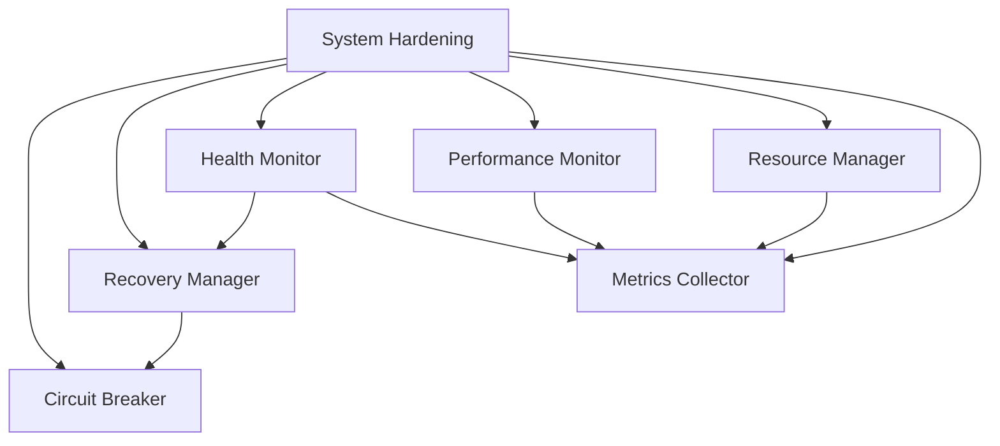

# System Hardening & Integration Documentation

## Overview

This document outlines the system hardening implementation for the grym-synth, focusing on error recovery, performance monitoring, and resource management. The system provides robust fault tolerance, automated recovery mechanisms, and comprehensive monitoring capabilities.

## Architecture

The hardening system consists of several key components that work together:



### Components

1. **Circuit Breaker**
   - Prevents cascading failures
   - State management (closed, open, half-open)
   - Configurable thresholds and timeouts
   - Automatic recovery attempts

2. **Recovery Manager**
   - Service health monitoring
   - Automated recovery procedures
   - Circuit breaker integration
   - Maximum retry attempts

3. **Health Monitor**
   - Real-time service status tracking
   - Memory usage monitoring
   - System-wide health status
   - Event-based monitoring

4. **Performance Monitor**
   - CPU usage tracking
   - Memory utilization
   - Event loop latency
   - Operation metrics collection
   - Performance thresholds

5. **Resource Manager**
   - Resource allocation
   - Priority-based queuing
   - Automatic cleanup
   - Resource health tracking

6. **Metrics Collector**
   - Centralized metrics gathering
   - Configurable retention periods
   - Query capabilities
   - Metric aggregation

## Configuration

The system hardening can be configured through the `SystemHardeningConfig` interface:

```typescript
interface SystemHardeningConfig {
  enableHealthMonitoring: boolean;    // Enable health monitoring
  enablePerformanceMonitoring: boolean; // Enable performance tracking
  enableErrorRecovery: boolean;       // Enable recovery mechanisms
  enableResourceManagement: boolean;  // Enable resource management
  healthCheckIntervalMs?: number;     // Health check interval
  performanceCheckIntervalMs?: number; // Performance check interval
  maxResourceMemory?: string;         // Max memory per resource
  recoverableServices?: string[];     // Services that can be recovered
}
```

### Example Configuration

```typescript
const config: SystemHardeningConfig = {
  enableHealthMonitoring: true,
  enablePerformanceMonitoring: true,
  enableErrorRecovery: true,
  enableResourceManagement: true,
  healthCheckIntervalMs: 30000,     // 30 seconds
  performanceCheckIntervalMs: 5000, // 5 seconds
  maxResourceMemory: '1GB',
  recoverableServices: ['audio-processing', 'model-inference']
};
```

## Usage

### Initialization

```typescript
import { SystemHardening } from '../integration/system-hardening';
import { ServiceRegistry } from '../services/service-registry';
import { MemoryManager } from '../utils/memory';

// Create dependencies
const serviceRegistry = new ServiceRegistry();
const memoryManager = new MemoryManager({ maxMemory: '4GB' });

// Initialize system hardening
const hardening = new SystemHardening(
  serviceRegistry,
  memoryManager,
  config
);

await hardening.initialize();
```

### Health Monitoring

```typescript
// Get current system health
const healthStatus = hardening.getHealthStatus();
console.log(`System Status: ${healthStatus.status}`);
console.log(`Memory Usage: ${healthStatus.memory.percentage}%`);

// Get service-specific health
const serviceHealth = hardening.getServiceHealth('audio-processing');
if (serviceHealth) {
  console.log(`Service Status: ${serviceHealth.status}`);
  console.log(`Circuit State: ${serviceHealth.circuitState}`);
}
```

### Resource Management

```typescript
// Request a resource
const resource = await hardening.requestResource(
  'cpu',
  'task-123',
  2, // priority
  { core: 0 } // requirements
);

// Release a resource
hardening.releaseResource(resource.id, 'task-123');

// Get resource statistics
const stats = hardening.getResourceStats();
console.log(`Available Resources: ${stats.ready}`);
console.log(`Active Allocations: ${stats.activeAllocations}`);
```

### Performance Monitoring

```typescript
// Get performance metrics
const metrics = hardening.getPerformanceMetrics();
console.log(`CPU Usage: ${metrics.cpu.process}%`);
console.log(`Memory Usage: ${metrics.memory.heapUsed} bytes`);
console.log(`Event Loop Latency: ${metrics.eventLoop.latency}ms`);
```

## Error Recovery

The system implements a multi-layered approach to error recovery:

1. **Circuit Breaker Pattern**
   - Prevents cascading failures
   - Automatic service isolation
   - Gradual recovery attempts

2. **Service Recovery**
   - Automated recovery procedures
   - Configurable retry attempts
   - Graceful degradation

3. **Resource Management**
   - Automatic resource cleanup
   - Priority-based allocation
   - Resource health tracking

## Best Practices

1. **Configuration**
   - Set appropriate health check intervals based on service criticality
   - Configure memory limits based on available system resources
   - Define recoverable services based on their resilience requirements

2. **Monitoring**
   - Monitor system health regularly
   - Set up alerts for degraded or unhealthy states
   - Track resource utilization trends

3. **Resource Management**
   - Use appropriate priority levels for critical tasks
   - Release resources promptly after use
   - Monitor resource allocation patterns

4. **Error Recovery**
   - Implement proper error handling in services
   - Configure appropriate circuit breaker thresholds
   - Monitor recovery success rates

## Integration Points

1. **Service Registry**
   - Services must implement the ModelService interface
   - Register services before system initialization
   - Maintain service lifecycle methods

2. **Memory Management**
   - Configure appropriate memory limits
   - Monitor memory usage patterns
   - Handle memory pressure events

3. **Metrics Collection**
   - Define relevant metrics for your services
   - Set appropriate retention periods
   - Implement metric aggregation as needed

## Shutdown

```typescript
// Proper shutdown
hardening.shutdown();
```

This will:
- Stop all monitoring
- Release resources
- Clear metrics
- Stop recovery processes

## Troubleshooting

Common issues and solutions:

1. **High Resource Usage**
   - Check resource allocation patterns
   - Verify resource cleanup
   - Monitor memory usage

2. **Frequent Circuit Breaks**
   - Review failure thresholds
   - Check service health
   - Analyze error patterns

3. **Performance Issues**
   - Monitor event loop latency
   - Check CPU usage patterns
   - Verify memory management

4. **Recovery Failures**
   - Check service initialization
   - Verify recovery procedures
   - Review error logs

## Metrics & Monitoring

Key metrics to monitor:

1. **System Health**
   - Overall system status
   - Service health states
   - Memory utilization

2. **Performance**
   - CPU usage
   - Memory patterns
   - Event loop latency

3. **Resources**
   - Allocation patterns
   - Usage efficiency
   - Cleanup rates

4. **Recovery**
   - Success rates
   - Circuit breaker states
   - Recovery times

