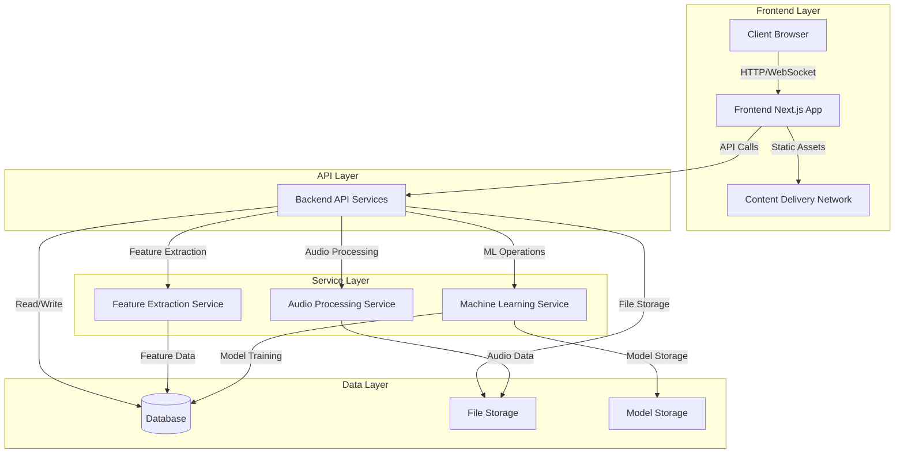

# grym-synth - System Overview

## Table of Contents
- [Introduction](#introduction)
- [Architecture Diagram](#architecture-diagram)
- [Component Relationships](#component-relationships)
- [Data Flow](#data-flow)
- [Key Technologies](#key-technologies)
- [System Requirements](#system-requirements)

## Introduction

The grym-synth is a comprehensive platform for audio processing, analysis, and machine learning. It enables users to upload, process, analyze, and learn from audio data through an intuitive interface and powerful backend services.

The system is designed with a modular architecture that separates concerns between the frontend user interface, backend processing services, and data storage. This separation allows for independent scaling of components and easier maintenance.

## Architecture Diagram

## Component Relationships

### Frontend Layer
- **Client Browser**: The user interface accessed through web browsers
- **Next.js App**: Server-side rendered React application providing the user interface
- **Content Delivery Network**: Delivers static assets (JavaScript, CSS, images) to clients

### API Layer
- **Backend API Services**: RESTful and WebSocket APIs for client-server communication

### Service Layer
- **Audio Processing Service**: Handles audio file processing, conversion, and manipulation
- **Feature Extraction Service**: Extracts audio features for analysis and machine learning
- **Machine Learning Service**: Manages model training, inference, and optimization

### Data Layer
- **Database**: Stores metadata, user information, and feature data
- **File Storage**: Stores audio files and processed outputs
- **Model Storage**: Stores trained machine learning models

## Data Flow

### Audio Upload and Processing Flow

1. User uploads an audio file through the web interface
2. Frontend validates and sends the file to the Backend API
3. Backend API stores the raw file in File Storage
4. Backend API initiates processing tasks in the Audio Processing Service
5. Audio Processing Service processes the file (normalization, filtering, etc.)
6. Processed file is stored in File Storage
7. Feature Extraction Service extracts audio features
8. Extracted features are stored in the Database
9. Backend API notifies the Frontend of completion via WebSocket
10. Frontend updates the UI to display the processed audio and features

### Machine Learning Flow

1. User selects audio files and initiates model training
2. Frontend sends training request to Backend API
3. Backend API validates the request and initiates training in the Machine Learning Service
4. Machine Learning Service retrieves features from the Database
5. Machine Learning Service trains the model
6. Trained model is stored in Model Storage
7. Model metadata is stored in the Database
8. Backend API notifies the Frontend of completion
9. Frontend updates the UI to display model performance metrics

## Key Technologies

### Frontend
- **Next.js**: React framework for server-side rendering and static site generation
- **React**: JavaScript library for building user interfaces
- **TailwindCSS**: Utility-first CSS framework for styling
- **Three.js**: JavaScript 3D library for audio visualizations
- **Web Audio API**: Browser API for audio processing and visualization

### Backend
- **Node.js**: JavaScript runtime for the server environment
- **Express**: Web framework for Node.js
- **WebSockets**: Protocol for real-time communication
- **TypeScript**: Typed superset of JavaScript for improved code quality

### Audio Processing
- **FFmpeg**: Complete solution for audio/video processing
- **AudioLDM**: AI model for audio generation and transformation
- **GAMA**: Advanced audio model for pattern recognition
- **XenakisLDM**: Mathematical framework for audio transformations

### Machine Learning
- **TensorFlow.js**: Machine learning framework for JavaScript
- **scikit-learn**: Machine learning library for Python
- **Feature Memory System**: Custom system for audio pattern learning and recognition

### Data Storage
- **MongoDB**: NoSQL database for flexible data storage
- **Redis**: In-memory data structure store for caching
- **MinIO**: High-performance object storage for audio files
- **PostgreSQL**: Relational database for structured data

### DevOps
- **Docker**: Containerization platform
- **Kubernetes**: Container orchestration
- **GitHub Actions**: CI/CD platform
- **Prometheus & Grafana**: Monitoring and alerting

## System Requirements

### Minimum Server Requirements

#### Production Environment
- **CPU**: 4+ cores, 2.0 GHz or higher
- **RAM**: 16 GB minimum, 32 GB recommended
- **Storage**: 100 GB SSD minimum
- **Network**: 1 Gbps Ethernet
- **Operating System**: Ubuntu 20.04 LTS or later

#### Development Environment
- **CPU**: 2+ cores, 2.0 GHz or higher
- **RAM**: 8 GB minimum
- **Storage**: 50 GB SSD minimum
- **Operating System**: Windows 10/11, macOS 12+, or Ubuntu 20.04+

### Client Requirements

#### Web Browser
- **Chrome**: Version 90 or later
- **Firefox**: Version 88 or later
- **Safari**: Version 14 or later
- **Edge**: Version 90 or later

#### Hardware
- **CPU**: Dual-core processor, 2.0 GHz or higher
- **RAM**: 4 GB minimum
- **Graphics**: WebGL-compatible graphics card
- **Audio**: Audio output device
- **Network**: Broadband internet connection (10+ Mbps)

### Dependencies

#### Required Software
- **Node.js**: v16.x or later
- **npm**: v7.x or later or **yarn**: v1.22.x or later
- **Docker**: v20.x or later (for containerized deployment)
- **Python**: v3.9 or later (for ML components)

#### External Services
- **Email Service**: For user notifications
- **Cloud Storage**: For scalable file storage in production
- **CDN**: For efficient static asset delivery

## Scalability and Performance

The grym-synth is designed to scale horizontally across all layers:

1. **Frontend Layer**: Stateless and can be scaled by adding more instances behind a load balancer
2. **API Layer**: Stateless and can be scaled by adding more instances
3. **Service Layer**: Can be scaled independently based on workload
4. **Data Layer**: Supports sharding and replication for horizontal scaling

Performance optimizations include:

1. **Caching**: Redis caching for frequently accessed data
2. **Task Queue**: Background processing for computationally intensive tasks
3. **Streaming**: Audio streaming for large files
4. **Lazy Loading**: On-demand loading of audio data and visualizations
5. **WebAssembly**: Performance-critical algorithms compiled to WebAssembly
6. **Worker Threads**: Parallel processing for CPU-intensive operations

## Security Considerations

The grym-synth implements several security measures:

1. **Authentication**: JWT-based authentication for API access
2. **Authorization**: Role-based access control for resources
3. **Data Encryption**: TLS for data in transit, encryption for sensitive data at rest
4. **Input Validation**: Comprehensive validation of all user inputs
5. **Rate Limiting**: Protection against abuse and DoS attacks
6. **Audit Logging**: Comprehensive logging of security-relevant events
7. **Dependency Scanning**: Regular scanning for vulnerabilities in dependencies
8. **Container Security**: Minimal base images and regular security updates

