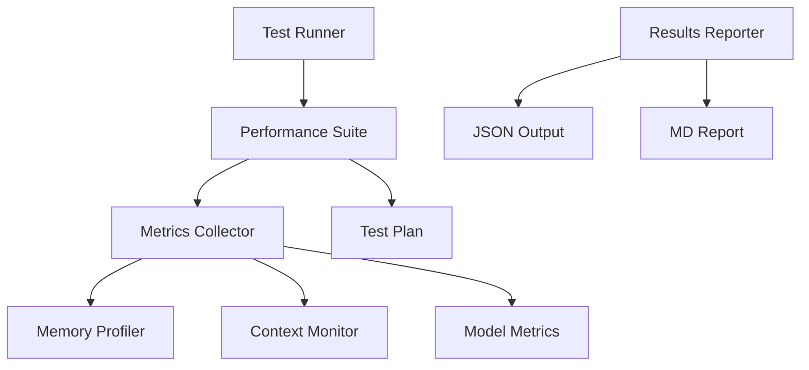

# TDR-011: Performance Testing Infrastructure

## Status
Proposed

## Context
The grym-synth needs a robust performance testing infrastructure to ensure reliable operation of its LLM integration. This includes measuring memory usage, response times, and model interaction efficiency.

## Decision
We will implement a modular performance testing infrastructure with the following key components:

1. Test Runner
2. Performance Suite
3. Metrics Collector
4. Test Plan Manager
5. Results Reporter

### Architecture Overview

### Key Components

#### Test Runner
- Orchestrates test execution
- Manages test lifecycle
- Handles resource cleanup
- Implements CLI interface
- Coordinates output generation

#### Performance Suite
- Implements test scenarios
- Manages test state
- Coordinates metrics collection
- Handles phase transitions
- Provides test isolation

#### Metrics Collector
- Collects performance metrics
- Implements sampling strategies
- Manages metric persistence
- Provides real-time monitoring
- Handles metric aggregation

#### Test Plan Manager
- Defines test phases
- Specifies success criteria
- Manages test configuration
- Handles phase transitions
- Validates results

### Success Criteria

#### Baseline Performance
- Memory usage < 14GB
- Response time < 1s
- Context preservation > 95%

#### Cross-Model Performance
- Switch time < 2s
- Context accuracy > 90%
- Memory growth < 100MB

#### System Stability
- Concurrent requests: 10
- System stability > 99%
- Error rate < 1%

## Consequences

### Positive
1. Standardized performance measurement
2. Early detection of performance regressions
3. Automated test execution
4. Comprehensive metrics collection
5. Clear success criteria

### Negative
1. Additional development overhead
2. Increased test execution time
3. Resource requirements for testing
4. Maintenance of test infrastructure

### Mitigations
1. Modular design for maintainability
2. Automated cleanup procedures
3. Configurable test parameters
4. Clear documentation
5. Error recovery mechanisms

## Implementation Strategy

### Phase 1: Core Infrastructure
1. Implement base metrics collector
2. Setup test runner framework
3. Create basic test suite
4. Add error handling
5. Implement cleanup routines

### Phase 2: Advanced Features
1. Add cross-model testing
2. Implement load testing
3. Add reporting system
4. Setup monitoring
5. Add trend analysis

### Phase 3: Integration
1. CI/CD pipeline integration
2. Monitoring system hooks
3. Alert system integration
4. Dashboard integration
5. Automated regression detection

## Technical Details

### Memory Management
- Use Node.js heap snapshots
- Implement garbage collection hooks
- Monitor memory leaks
- Track allocation patterns
- Measure cleanup efficiency

### Metrics Collection
- Non-blocking collection
- Configurable sampling rates
- Metric persistence
- Real-time monitoring
- Statistical analysis

### Error Handling
- Graceful degradation
- Resource protection
- Data preservation
- Error recovery
- Test resumption

### Reporting
- JSON results
- Markdown reports
- Performance graphs
- Trend analysis
- Failure details

## Alternatives Considered

### 1. Manual Testing
- Pros: Simpler implementation
- Cons: Not scalable, inconsistent results
- Rejected due to lack of reproducibility

### 2. Third-Party Solutions
- Pros: Ready-made solution
- Cons: Limited customization, external dependencies
- Rejected due to specific requirements

### 3. Distributed Testing
- Pros: Higher throughput
- Cons: Complex coordination, resource intensive
- Deferred for future consideration

## Dependencies

### Required
1. Node.js runtime
2. TypeScript compiler
3. Jest testing framework
4. Performance monitoring tools
5. Reporting libraries

### Optional
1. CI/CD integration
2. Monitoring systems
3. Dashboard tools
4. Alert systems
5. Trend analysis tools

## Future Considerations

### Planned Improvements
1. Continuous monitoring integration
2. Automated regression detection
3. Extended multi-model scenarios
4. Custom metric plugins
5. Cloud resource monitoring

### Integration Points
1. CI/CD pipeline
2. Monitoring systems
3. Alert systems
4. Dashboards
5. Analysis tools

## References

1. [Performance Testing Guide](./PERFORMANCE-TESTING.md)
2. [Performance Testing Architecture](./PERFORMANCE-TESTING-ARCHITECTURE.md)
3. [Performance Testing Types](./PERFORMANCE-TESTING-TYPES.md)
4. [Jest Documentation](https://jestjs.io/docs/getting-started)
5. [Node.js Performance](https://nodejs.org/api/perf_hooks.html)

## Review Notes

### Security Considerations
1. Resource limits
2. Access controls
3. Data protection
4. Clean state between runs
5. Secure reporting

### Performance Impact
1. Minimal overhead during collection
2. Efficient resource usage
3. Clean cleanup procedures
4. Optimized sampling
5. Controlled test isolation

### Maintenance Requirements
1. Regular test updates
2. Metric validation
3. Threshold adjustments
4. Documentation updates
5. Dependency management

