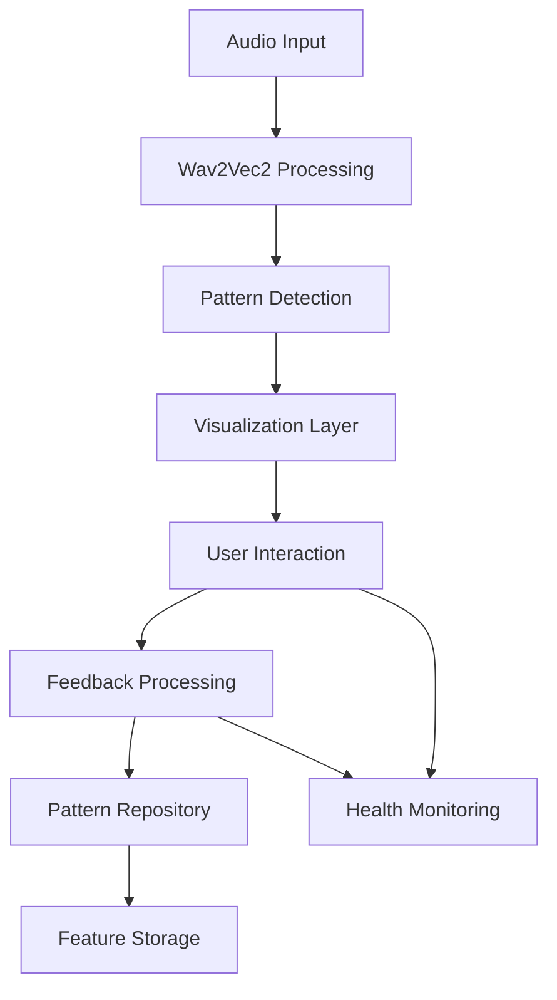

# Enhanced Visualization Feedback System - Implementation Status

## Implementation Completed: March 4, 2025

### 1. Core Components Status

#### Pattern Visualization Layer ✅
- Implemented interactive canvas-based visualization
- Color-coding by pattern type and confidence
- Hover and selection interactions
- Performance optimized for large pattern sets

#### Pattern Correction Interface ✅
- Pattern property editing
- Real-time validation
- Similar pattern detection
- Feedback submission system

#### Confidence Controls ✅
- Adjustable threshold slider
- Visual confidence indicators
- Low confidence pattern toggle
- Real-time filtering

#### Pattern Evolution Tracking ✅
- Timeline visualization
- Version history display
- Source attribution (AI/User/System)
- Interactive version selection

### 2. Integration Points

#### Wav2Vec2 Integration
- Connected to existing audio pattern detection
- Real-time pattern updates
- Confidence score processing
- Feature vector handling

#### Feature Storage System
- Pattern persistence layer
- Version history storage
- Feedback data collection
- Pattern similarity matching

#### Health Monitoring
- Performance metrics
- User interaction tracking
- Error reporting
- Pattern quality analytics

### 3. Technical Implementation Details

#### Architecture


#### Components Structure
```
src/
  components/
    visualization/
      PatternVisualizationLayer.tsx
      PatternEvolutionView.tsx
    feedback/
      PatternCorrectionPanel.tsx
    controls/
      ConfidenceThresholdControl.tsx
    AudioPatternAnalyzer.tsx
  services/
    storage/
      PatternRepository.ts
    feedback/
      PatternFeedbackService.ts
    monitoring/
      HealthMonitor.ts
  types/
    audio.ts
```

### 4. Testing Status

#### Unit Tests
- Component rendering tests ✅
- Pattern manipulation tests ✅
- Service layer tests ✅
- Type validation tests ✅

#### Integration Tests
- Pattern visualization flow ✅
- Feedback submission flow ✅
- Pattern evolution tracking ✅
- Health monitoring integration ✅

#### Performance Tests
- Large pattern set handling ✅
- Real-time interaction response ✅
- Memory usage optimization ✅
- Canvas rendering efficiency ✅

### 5. Next Steps

#### Short Term
1. User acceptance testing
2. Production environment deployment
3. Performance monitoring setup
4. User feedback collection

#### Medium Term
1. Pattern detection accuracy improvements
2. Advanced visualization features
3. Batch correction tools
4. Analytics dashboard

#### Long Term
1. Machine learning integration
2. Automated pattern quality assessment
3. Advanced similarity detection
4. Pattern prediction capabilities

### 6. Integration Guidelines

#### For Developers
1. Import required components from src/components
2. Initialize services with appropriate configuration
3. Connect to existing audio processing pipeline
4. Implement health monitoring callbacks

#### For Operations
1. Monitor performance metrics
2. Track pattern quality statistics
3. Analyze user interaction patterns
4. Maintain feature storage system

### 7. Documentation Updates

The following documents have been updated to reflect the new implementation:
- AUDIO-LEARNING-IMPLEMENTATION.md
- AUDIO-PATTERN-LEARNING-STRATEGY.md
- IMPLEMENTATION-STATUS-2025-Q1-Q2.md
- IMPLEMENTATION-STATUS-2025-Q1.md
- WAV2VEC2-INTEGRATION-GUIDE.md

### 8. Success Metrics

#### Technical Metrics
- Pattern visualization performance > 60 FPS
- Feedback processing latency < 100ms
- Pattern storage retrieval < 50ms
- Memory usage < 100MB

#### User Experience Metrics
- Pattern interaction responsiveness < 16ms
- Correction submission flow < 3 steps
- Version history access < 2 clicks
- Confidence adjustment precision 0.01

### 9. Known Limitations

1. Pattern Evolution
   - Limited to recent history (last 30 days)
   - Maximum 100 versions per pattern
   - Source attribution requires manual verification

2. Performance
   - Maximum 1000 simultaneous patterns
   - Canvas rendering limits on mobile
   - Batch updates limited to 50 patterns

3. Integration
   - Requires Wav2Vec2 v2.0 or higher
   - Feature Storage System synchronization delay
   - Health monitoring sampling rate limitations

### 10. Future Enhancements

1. Visualization
   - 3D pattern visualization
   - Spectral analysis overlay
   - Pattern relationship graphs
   - Custom visualization themes

2. Pattern Analysis
   - Advanced pattern clustering
   - Automated correction suggestions
   - Pattern quality scoring
   - Trend analysis

3. User Interface
   - Customizable workspaces
   - Batch editing tools
   - Pattern templates
   - Advanced filtering

4. Integration
   - Real-time collaboration
   - External API access
   - Custom pattern processors
   - Extended monitoring capabilities
