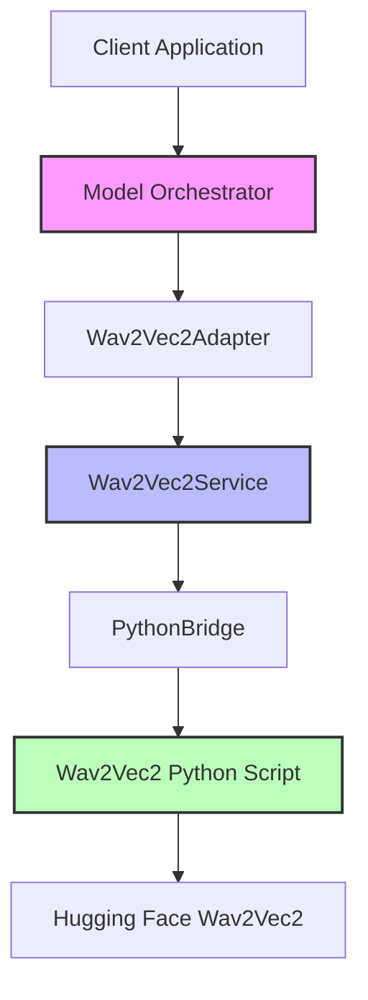
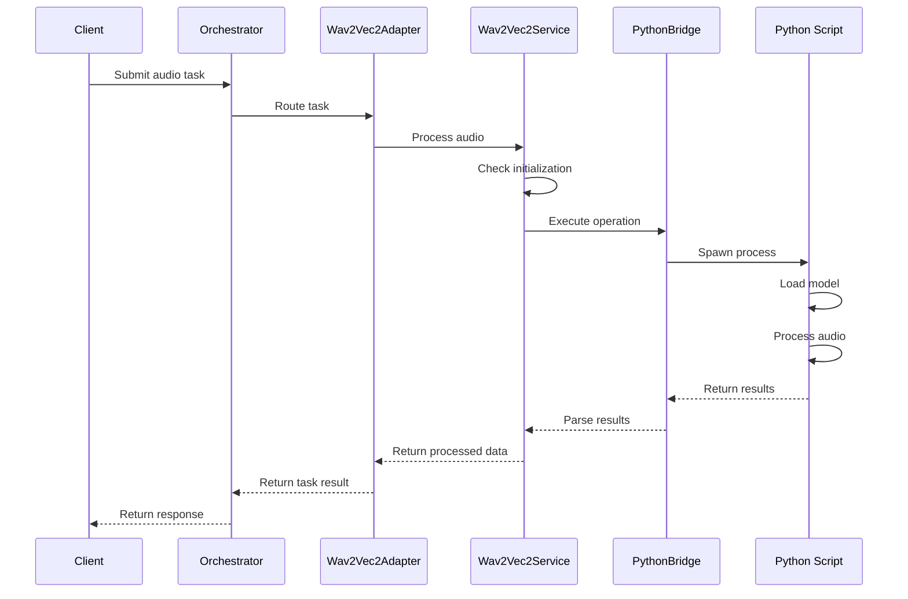

# Wav2Vec2 Integration Technical Design

## Overview

This document outlines the technical design for integrating the wav2vec2 model with our model orchestration system. The integration follows a hybrid approach - implementing core MVP functionality while designing for future capabilities.

## Architecture

### Component Overview



### Key Components

1. **Model Orchestrator**
   - Manages model lifecycle and task routing
   - Handles task queuing and resource allocation
   - Integrates with monitoring and metrics systems

2. **Wav2Vec2Adapter**
   - Implements ModelAdapter interface
   - Translates between orchestration tasks and service operations
   - Handles capability reporting and task validation

3. **Wav2Vec2Service**
   - Manages model lifecycle (initialization, cleanup)
   - Implements core audio processing operations
   - Handles memory management and resource tracking

4. **PythonBridge**
   - Manages communication between TypeScript and Python
   - Handles process lifecycle and error propagation
   - Implements efficient data serialization

5. **Wav2Vec2 Python Script**
   - Implements direct model interactions
   - Handles audio processing operations
   - Manages GPU resources when available

## Interface Definitions

### ModelAdapter Interface

```typescript
interface ModelAdapter {
  handleTask(task: AudioTask): Promise<TaskResult>;
  getCapabilities(): ModelCapabilities;
}
```

### AudioProcessorMVP Interface

```typescript
interface AudioProcessorMVP {
  initialize(): Promise<void>;
  process(audio: AudioBuffer): Promise<ProcessedAudio>;
  analyze(audio: AudioBuffer): Promise<BasicFeatures>;
  dispose(): Promise<void>;
}
```

### Python/TypeScript Bridge

The bridge uses a combination of:
1. Process spawning with stdio communication
2. JSON serialization for data exchange
3. UUID-based request tracking
4. Error propagation via exit codes and structured messages

## Processing Flows

### Audio Processing Sequence



## Failure Points & Mitigation

1. **Model Initialization Failures**
   - Issue: Model fails to load or GPU unavailable
   - Mitigation: 
     - Implement lazy loading with fallback
     - Cache initialization status
     - Provide CPU fallback path

2. **Process Communication Failures**
   - Issue: Bridge communication breaks
   - Mitigation:
     - Implement timeout handling
     - Add process health checks
     - Create recovery mechanism

3. **Memory Management Issues**
   - Issue: Memory leaks or excessive usage
   - Mitigation:
     - Implement proper cleanup in dispose()
     - Add memory tracking
     - Set resource limits

4. **Task Processing Errors**
   - Issue: Processing failures
   - Mitigation:
     - Add comprehensive error handling
     - Implement retry logic
     - Provide detailed error reporting

## Implementation Timeline (Month 2, Phase 1)

#### Week 1: Core Integration
1. **Setup & Basic Integration** (Days 1-2)
   - Python environment configuration
   - Basic wav2vec2 service implementation
   - Simple Python bridge setup

2. **Core Processing** (Days 3-4)
   - Implement audio processing MVP
   - Add basic error handling
   - Create initial tests

3. **Initial Testing** (Day 5)
   - Unit test implementation
   - Basic integration tests
   - Performance baseline testing

**Success Metrics (Week 1)**:
- Audio processing: < 500ms for basic operations
- Basic operations functional
- Core tests passing

#### Week 2: Enhancement & Optimization
1. **Performance Optimization** (Days 1-2)
   - Memory management implementation
   - Performance improvements
   - Resource tracking

2. **Error Handling & Recovery** (Days 3-4)
   - Enhanced error handling
   - Circuit breaker implementation
   - Recovery mechanisms

3. **Final Testing & Documentation** (Day 5)
   - Complete test coverage
   - Documentation updates
   - Integration verification

**Success Metrics (Week 2)**:
- System reliability: > 95% uptime
- Memory usage: < 2GB peak
- Test coverage: > 90%
- Pattern recognition: < 200ms
- Storage operations: < 50ms

### Future Phases

#### Phase 2: Enhancement (Months 3-4)
- Advanced operations
- Performance optimizations
- Caching system
- Enhanced monitoring

#### Phase 3: Advanced Features (Months 5-6)
- Streaming support
- Batch processing
- Advanced audio features
- Integration with GAMA

## Error Handling Strategy

### 1. Layered Error Management
```typescript
interface ErrorContext {
  layer: 'validation' | 'context' | 'resource' | 'execution';
  severity: 'warning' | 'error' | 'critical';
  retryable: boolean;
  metadata: Record<string, any>;
}

class Wav2Vec2Error extends Error {
  constructor(
    message: string,
    public context: ErrorContext
  ) {
    super(message);
  }
}
```

### 2. Resource Management
- Proper initialization/cleanup cycles
- Memory usage monitoring
- Resource leak prevention
- Automated cleanup on errors

### 3. Circuit Breaker Implementation
```typescript
interface CircuitBreakerConfig {
  maxFailures: number;
  resetTimeoutMs: number;
  monitoredOperations: Set<string>;
}

class Wav2Vec2CircuitBreaker {
  private failures: Map<string, number>;
  private lastFailure: Map<string, number>;
  private state: 'closed' | 'open' | 'half-open';
  
  constructor(private config: CircuitBreakerConfig) {}
  
  async executeOperation<T>(
    operation: () => Promise<T>,
    operationType: string
  ): Promise<T>;
}
```

## Integration with Orchestration System

### 1. Dynamic Capability Assessment
```typescript
interface Wav2Vec2Capabilities extends ModelCapabilities {
  audioProcessing: {
    maxDuration: number;
    supportedFormats: string[];
    features: {
      transcription: number;
      analysis: number;
    };
  };
  performanceMetrics: {
    avgLatency: number;
    throughput: number;
    successRate: number;
  };
}
```

### 2. Parallel Execution Support
```typescript
interface ParallelConfig {
  maxConcurrent: number;
  timeoutMs: number;
  resourceLimits: ResourceConstraints;
}

class ParallelExecutionManager {
  constructor(private config: ParallelConfig) {}
  
  async executeParallel(
    tasks: AudioTask[],
    dependencies?: TaskDependencyGraph
  ): Promise<ParallelResult>;
}
```

### 3. Result Synthesis Integration
```typescript
interface SynthesisOptions {
  weights: Map<string, number>;
  qualityThreshold: number;
  conflictResolution: 'weighted' | 'latest' | 'highest-confidence';
}

class ResultSynthesizer {
  constructor(private options: SynthesisOptions) {}
  
  async synthesize(
    results: ModelResult[]
  ): Promise<SynthesizedResult>;
}
```

## Monitoring & Metrics

Key metrics to track:
1. Initialization time and success rate
2. Processing latency
3. Memory usage patterns
4. Error rates by category
5. Resource utilization

## Dependencies

1. **Required Packages**
   - transformers
   - torch
   - soundfile
   - typescript
   - node-uuid

2. **System Requirements**
   - Python 3.9+
   - Node.js 18+
   - CUDA support (optional)
   - 4GB+ RAM

## Local Development Setup

### 1. Environment Configuration

```bash
# Create Python virtual environment
python -m venv wav2vec2_env
source wav2vec2_env/bin/activate  # Linux/Mac
.\wav2vec2_env\Scripts\activate   # Windows

# Install Python dependencies
pip install torch torchaudio --index-url https://download.pytorch.org/whl/cu118
pip install transformers soundfile

# Install Node dependencies
npm install typescript @types/node uuid
```

### 2. Project Structure Setup

```bash
mkdir -p src/{services,adapters,utils} scripts tests
touch src/services/audio/Wav2Vec2Service.ts
touch src/adapters/Wav2Vec2Adapter.ts
touch src/utils/pythonBridge.ts
touch scripts/wav2vec2_operations.py
```

### 3. Development Tools

```json
{
  "scripts": {
    "build": "tsc",
    "test": "jest",
    "lint": "eslint src/**/*.ts",
    "dev": "ts-node-dev --respawn src/services/audio/Wav2Vec2Service.ts"
  },
  "devDependencies": {
    "@types/jest": "^29.0.0",
    "@typescript-eslint/eslint-plugin": "^5.0.0",
    "@typescript-eslint/parser": "^5.0.0",
    "eslint": "^8.0.0",
    "jest": "^29.0.0",
    "ts-jest": "^29.0.0",
    "ts-node-dev": "^2.0.0",
    "typescript": "^4.9.0"
  }
}
```

### 4. Configuration Files

1. **tsconfig.json**
```json
{
  "compilerOptions": {
    "target": "ES2020",
    "module": "commonjs",
    "strict": true,
    "esModuleInterop": true,
    "skipLibCheck": true,
    "forceConsistentCasingInFileNames": true,
    "outDir": "./dist"
  },
  "include": ["src/**/*"],
  "exclude": ["node_modules", "**/*.test.ts"]
}
```

2. **jest.config.js**
```javascript
module.exports = {
  preset: 'ts-jest',
  testEnvironment: 'node',
  testMatch: ['**/*.test.ts'],
  collectCoverage: true,
  coverageDirectory: 'coverage',
  coverageThreshold: {
    global: {
      branches: 80,
      functions: 80,
      lines: 80,
      statements: 80
    }
  }
};
```

### 5. Quick Start

1. Clone repository and navigate to project directory
2. Run environment setup commands
3. Install dependencies: `npm install`
4. Build project: `npm run build`
5. Run tests: `npm test`
6. Start development server: `npm run dev`

### 6. Debugging Setup

1. **VS Code Launch Configuration**
```json
{
  "version": "0.2.0",
  "configurations": [
    {
      "type": "node",
      "request": "launch",
      "name": "Debug Service",
      "skipFiles": ["<node_internals>/**"],
      "program": "${workspaceFolder}/src/services/audio/Wav2Vec2Service.ts",
      "outFiles": ["${workspaceFolder}/dist/**/*.js"],
      "preLaunchTask": "npm: build"
    }
  ]
}
```

2. Enable source maps in tsconfig.json
3. Use VS Code's debugging features for Python bridge

## Security Considerations

1. Input validation for all audio files
2. Sanitization of Python script parameters
3. Resource limits enforcement
4. Error message sanitization
5. Process isolation

## Deployment Notes

1. Python environment setup required
2. Model download on first use
3. GPU drivers if using CUDA
4. Memory allocation configuration
5. Logging setup
