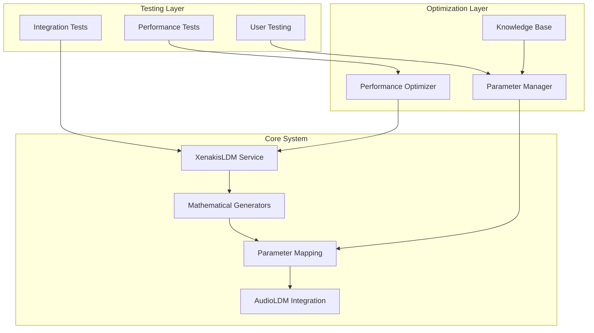
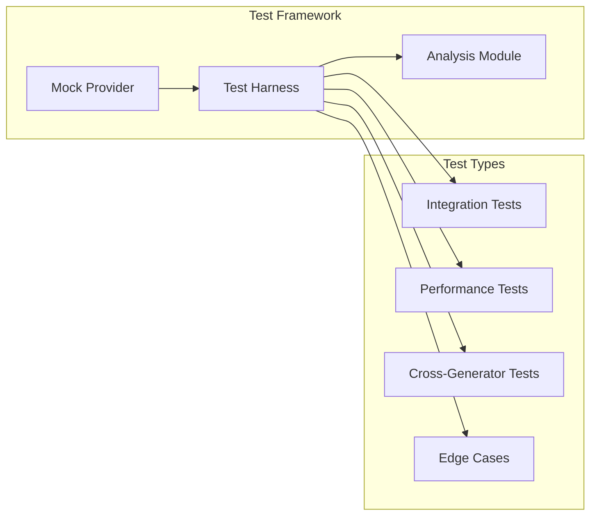

# XenakisLDM Testing & Optimization Plan

## Overview

This document outlines the comprehensive testing, feedback collection, and optimization strategy for the XenakisLDM system, building on the existing implementation to ensure robust performance, high-quality musical output, and excellent user experience.

## Architecture

### System Layers



### Testing Infrastructure



## Phase 1: Testing Infrastructure (2 weeks)

### Test Environment Configuration

```typescript
interface TestEnvironment {
  xenakisLDM: XenakisLDMService;
  audioLDM: AudioLDMService;
  generators: Map<string, MathematicalGenerator>;
  metrics: MetricsCollector;
}

interface TestCase {
  name: string;
  parameters: XenakisParameters;
  expectedResults: TestExpectations;
  validationFn: (result: AudioGenerationResult) => Promise<boolean>;
}

class TestHarness {
  private env: TestEnvironment;
  private testCases: Map<string, TestCase>;

  async setupEnvironment(): Promise<void>;
  async runTestSuite(suite: string): Promise<TestResults>;
  async collectMetrics(): Promise<PerformanceMetrics>;
}
```

### Key Features
- Isolated test environments for different test types
- Comprehensive metrics collection system
- Test data management framework
- Automated test execution pipeline

## Phase 2: Integration Testing (4 weeks)

### Test Implementation

1. Generator Integration Tests
   - Stochastic parameter distribution validation
   - Sieve theory structural verification
   - Game theory state transitions
   - Set theory transformations
   - Cross-generator interactions

2. Performance Testing Framework

```typescript
interface PerformanceTestConfig {
  duration: number;
  load: LoadProfile;
  resourceLimits: ResourceConstraints;
  metrics: MetricDefinition[];
}

class PerformanceTestRunner {
  async measureResourceUsage(
    test: TestCase,
    config: PerformanceTestConfig
  ): Promise<ResourceMetrics>;

  async analyzeBottlenecks(
    metrics: ResourceMetrics
  ): Promise<BottleneckAnalysis>;
}
```

### Test Coverage
- Core service functionality
- Parameter mapping accuracy
- AudioLDM integration
- Error handling and recovery
- Resource management
- Edge case handling

## Phase 3: User Feedback System (4 weeks)

### Collection System Architecture

```typescript
interface FeedbackSession {
  id: string;
  userId: string;
  audioSamples: AudioSample[];
  responses: FeedbackResponse[];
  metadata: SessionMetadata;
}

class FeedbackCollector {
  async createSession(userId: string): Promise<FeedbackSession>;
  async recordFeedback(sessionId: string, feedback: FeedbackResponse): Promise<void>;
  async analyzeFeedback(sessionId: string): Promise<FeedbackAnalysis>;
}
```

### Analysis Pipeline

```typescript
interface FeedbackAnalysis {
  userSatisfaction: {
    overall: number;
    byFeature: Map<string, number>;
  };
  qualityMetrics: AudioQualityMetrics;
  recommendations: ParameterAdjustment[];
}

class FeedbackAnalyzer {
  async analyzeParameters(feedback: FeedbackSession[]): Promise<ParameterAnalysis>;
  async generateRecommendations(analysis: ParameterAnalysis): Promise<Recommendation[]>;
}
```

## Phase 4: Parameter Optimization (3 weeks)

### Optimization Framework

```typescript
interface OptimizationConfig {
  targetMetrics: {
    performance: PerformanceTargets;
    quality: QualityTargets;
  };
  constraints: SystemConstraints;
  learningRate: number;
}

class ParameterOptimizer {
  async optimizeParameters(
    baseline: XenakisParameters,
    feedback: UserFeedback[],
    config: OptimizationConfig
  ): Promise<OptimizedParameters>;

  async validateOptimization(
    original: AudioGenerationResult,
    optimized: AudioGenerationResult
  ): Promise<ValidationResults>;
}
```

### Knowledge Base System

```typescript
interface KnowledgeEntry {
  context: GenerationContext;
  parameters: XenakisParameters;
  performance: PerformanceMetrics;
  feedback: UserFeedback[];
  recommendations: Recommendation[];
}

class KnowledgeBase {
  async addEntry(entry: KnowledgeEntry): Promise<void>;
  async findSimilarContexts(context: GenerationContext): Promise<KnowledgeEntry[]>;
  async generateRecommendations(context: GenerationContext): Promise<Recommendation[]>;
}
```

## Phase 5: Documentation and Best Practices (2 weeks)

### Technical Documentation
1. System Architecture Updates
2. Performance Optimization Guidelines
3. Testing Procedures
4. Error Handling Patterns

### User Documentation
1. Parameter Optimization Guides
2. Context-Specific Best Practices
3. Troubleshooting Guides
4. Case Studies

## Success Metrics

### Technical Performance
- System stability: 99.9%
- Memory usage reduction: 30%
- CPU utilization reduction: 25%
- Generation speed improvement: 20%

### User Experience
- Overall satisfaction: 8.5/10
- Musical quality vs baselines: +15%
- Parameter control usability: 8/10
- Learning curve: "Moderately easy"

### Creative Metrics
- Generated content uniqueness: 85%
- Artistic value rating: 7.5/10
- Professional use potential: 70%
- Creative inspiration rating: 8/10

## Risk Mitigation

### 1. Performance Risks
- Implement gradual optimization rollout
- Maintain performance baselines
- Regular benchmark testing
- Resource usage monitoring

### 2. User Adoption Risks
- Early user involvement
- Regular feedback collection
- Iterative improvements
- Clear documentation

### 3. Technical Integration Risks
- Comprehensive integration testing
- Fallback mechanisms
- Detailed error tracking
- Version control strategy

## Timeline

1. Testing Infrastructure Setup: Weeks 1-2
   - Environment configuration
   - Test framework implementation
   - Metrics collection setup

2. Integration Testing: Weeks 3-6
   - Core functionality testing
   - Performance testing
   - Edge case validation

3. User Feedback Collection: Weeks 7-10
   - Feedback system implementation
   - User study execution
   - Initial analysis

4. Parameter Optimization: Weeks 11-13
   - Optimization framework development
   - Knowledge base implementation
   - Parameter tuning

5. Documentation: Weeks 14-15
   - Technical documentation
   - User guides
   - Best practices compilation

## Implementation Strategy

1. Iterative Development
   - Two-week sprint cycles
   - Regular progress reviews
   - Continuous integration
   - Automated testing

2. Quality Assurance
   - Code review requirements
   - Test coverage targets
   - Performance benchmarks
   - User feedback integration

3. Deployment
   - Staged rollout
   - Performance monitoring
   - User support
   - Feedback collection

## Next Steps

1. Set up testing infrastructure
2. Implement core test suites
3. Configure feedback collection system
4. Begin user testing program
5. Develop optimization framework
