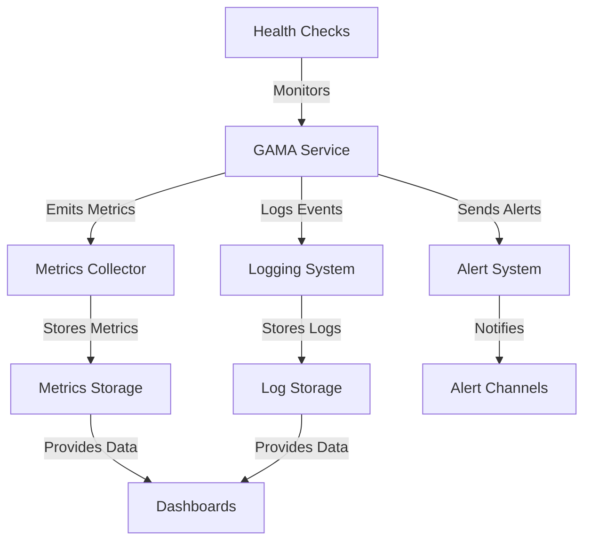

# GAMA Monitoring Guide

## Overview

This guide provides comprehensive information on monitoring the GAMA integration in the grym-synth. It covers metrics collection, alerting, dashboards, and best practices for ensuring the health and performance of the GAMA system.

## Monitoring Architecture

The GAMA monitoring system consists of several components:



### Components:

1. **Metrics Collector**: Collects performance and operational metrics from the GAMA service.
2. **Logging System**: Captures events and errors from the GAMA service.
3. **Alert System**: Sends notifications when issues are detected.
4. **Metrics Storage**: Stores collected metrics for analysis and visualization.
5. **Log Storage**: Stores logs for troubleshooting and analysis.
6. **Dashboards**: Visualizes metrics and logs for monitoring and analysis.
7. **Alert Channels**: Receives and distributes alerts to appropriate recipients.
8. **Health Checks**: Actively monitors the health of the GAMA service.

## Key Metrics

### 1. Performance Metrics

| Metric                    | Description                                | Unit      | Normal Range | Warning Threshold | Critical Threshold |
| ------------------------- | ------------------------------------------ | --------- | ------------ | ----------------- | ------------------ |
| `gama.process.duration`   | Time taken to process audio                | ms        | 100-5000     | >5000             | >10000             |
| `gama.extract.duration`   | Time taken to extract features             | ms        | 50-2000      | >2000             | >5000              |
| `gama.process.throughput` | Number of audio files processed per minute | count/min | >10          | <5                | <1                 |
| `gama.queue.length`       | Number of pending operations               | count     | 0-10         | >20               | >50                |
| `gama.queue.wait_time`    | Time spent in queue before processing      | ms        | 0-1000       | >2000             | >5000              |

### 2. Resource Metrics

| Metric                 | Description                     | Unit | Normal Range | Warning Threshold | Critical Threshold |
| ---------------------- | ------------------------------- | ---- | ------------ | ----------------- | ------------------ |
| `gama.memory.usage`    | Memory used by GAMA service     | MB   | 0-4096       | >4096             | >7168              |
| `gama.memory.peak`     | Peak memory usage               | MB   | 0-6144       | >6144             | >7680              |
| `gama.cpu.usage`       | CPU usage by GAMA service       | %    | 0-80         | >80               | >95                |
| `gama.gpu.memory`      | GPU memory used (if applicable) | MB   | 0-4096       | >4096             | >7168              |
| `gama.gpu.utilization` | GPU utilization (if applicable) | %    | 0-80         | >80               | >95                |
| `gama.disk.usage`      | Disk space used by GAMA         | MB   | 0-10240      | >10240            | >15360             |

### 3. Operational Metrics

| Metric                    | Description                                  | Unit  | Normal Range | Warning Threshold | Critical Threshold |
| ------------------------- | -------------------------------------------- | ----- | ------------ | ----------------- | ------------------ |
| `gama.operations.total`   | Total number of operations                   | count | -            | -                 | -                  |
| `gama.operations.success` | Number of successful operations              | count | -            | -                 | -                  |
| `gama.operations.error`   | Number of failed operations                  | count | 0-10         | >10               | >50                |
| `gama.error.rate`         | Error rate as percentage of total operations | %     | 0-1          | >1                | >5                 |
| `gama.bridge.restarts`    | Number of Python bridge restarts             | count | 0            | >1                | >3                 |
| `gama.model.load_time`    | Time taken to load the model                 | ms    | 0-30000      | >30000            | >60000             |

### 4. Quality Metrics

| Metric                            | Description                                    | Unit        | Normal Range | Warning Threshold | Critical Threshold |
| --------------------------------- | ---------------------------------------------- | ----------- | ------------ | ----------------- | ------------------ |
| `gama.quality.validation_success` | Percentage of outputs passing validation       | %           | 95-100       | <95               | <90                |
| `gama.quality.confidence`         | Average confidence score                       | score (0-1) | 0.7-1.0      | <0.7              | <0.5               |
| `gama.quality.nan_rate`           | Percentage of outputs with NaN values          | %           | 0            | >0                | >1                 |
| `gama.quality.out_of_range`       | Percentage of outputs with out-of-range values | %           | 0-1          | >1                | >5                 |

## Metrics Collection

### 1. Prometheus Integration

The GAMA service exposes metrics in Prometheus format at the `/metrics` endpoint. To collect these metrics with Prometheus:

1. Add the following to your `prometheus.yml` configuration:

```yaml
scrape_configs:
  - job_name: 'gama'
    scrape_interval: 15s
    static_configs:
      - targets: ['localhost:3000']
```

2. Restart Prometheus to apply the configuration.

### 2. Custom Metrics Collection

The GAMA service also provides a metrics API that can be used to collect metrics programmatically:

```typescript
// Example of collecting metrics programmatically
import { getMetrics } from '@grym-synth/gama-integration';

async function collectMetrics() {
  const metrics = await getMetrics();
  console.log('GAMA Metrics:', metrics);

  // Process or store metrics as needed
  storeMetrics(metrics);
}

// Collect metrics every minute
setInterval(collectMetrics, 60000);
```

### 3. Logging Integration

The GAMA service logs events and errors using a configurable logging system. To integrate with common logging platforms:

#### Winston Logger (Default)

```typescript
// Configure Winston logger
const logger = winston.createLogger({
  level: 'info',
  format: winston.format.json(),
  defaultMeta: { service: 'gama' },
  transports: [
    new winston.transports.File({ filename: 'logs/gama-error.log', level: 'error' }),
    new winston.transports.File({ filename: 'logs/gama.log' }),
    new winston.transports.Console({
      format: winston.format.combine(
        winston.format.colorize(),
        winston.format.simple()
      )
    })
  ]
});
```

#### ELK Stack Integration

```typescript
// Add Elasticsearch transport
const { ElasticsearchTransport } = require('winston-elasticsearch');

const esTransport = new ElasticsearchTransport({
  level: 'info',
  index: 'gama-logs',
  clientOpts: {
    node: 'http://localhost:9200'
  }
});

logger.add(esTransport);
```

## Alerting

### 1. Alert Configuration

The GAMA service includes an alert system that can be configured to send notifications when issues are detected. Configure alerts in the GAMA configuration file:

```json
"alertConfig": {
  "email": {
    "enabled": true,
    "recipients": ["alerts@example.com"],
    "smtpConfig": {
      "host": "smtp.example.com",
      "port": 587,
      "secure": false,
      "auth": {
        "user": "alerts@example.com",
        "pass": "password"
      }
    }
  },
  "slack": {
    "enabled": true,
    "webhook": "https://hooks.slack.com/services/XXX/YYY/ZZZ",
    "channel": "#gama-alerts"
  },
  "pagerDuty": {
    "enabled": true,
    "integrationKey": "your-integration-key",
    "severity": "critical"
  }
}
```

### 2. Alert Types

The GAMA service generates the following types of alerts:

| Alert Type            | Description                             | Severity | Default Channels        |
| --------------------- | --------------------------------------- | -------- | ----------------------- |
| `HighMemoryUsage`     | Memory usage exceeds threshold          | Warning  | Email, Slack            |
| `CriticalMemoryUsage` | Memory usage exceeds critical threshold | Critical | Email, Slack, PagerDuty |
| `HighCpuUsage`        | CPU usage exceeds threshold             | Warning  | Email, Slack            |
| `SlowOperation`       | Operation duration exceeds threshold    | Warning  | Email, Slack            |
| `HighErrorRate`       | Error rate exceeds threshold            | Warning  | Email, Slack            |
| `CriticalErrorRate`   | Error rate exceeds critical threshold   | Critical | Email, Slack, PagerDuty |
| `BridgeRestart`       | Python bridge restarted                 | Warning  | Email, Slack            |
| `ServiceDown`         | GAMA service is not responding          | Critical | Email, Slack, PagerDuty |
| `ModelLoadFailure`    | Failed to load GAMA model               | Critical | Email, Slack, PagerDuty |
| `QualityIssue`        | Output quality below threshold          | Warning  | Email, Slack            |

### 3. Custom Alert Handlers

You can implement custom alert handlers to integrate with additional notification systems:

```typescript
// Example of a custom alert handler
class TeamsAlertHandler implements AlertHandler {
  name = 'teams';

  constructor(private config: TeamsConfig) {}

  async handleAlert(alert: Alert): Promise<void> {
    // Create Teams message card
    const card = {
      "@type": "MessageCard",
      "@context": "http://schema.org/extensions",
      "themeColor": alert.severity === 'critical' ? "FF0000" : "FFA500",
      "summary": `GAMA Alert: ${alert.type}`,
      "sections": [
        {
          "activityTitle": `GAMA Alert: ${alert.type}`,
          "activitySubtitle": new Date(alert.timestamp).toISOString(),
          "facts": Object.entries(alert.data).map(([key, value]) => ({
            "name": key,
            "value": JSON.stringify(value)
          })),
          "markdown": true
        }
      ]
    };

    // Send to Teams webhook
    await fetch(this.config.webhook, {
      method: 'POST',
      headers: {
        'Content-Type': 'application/json'
      },
      body: JSON.stringify(card)
    });
  }
}

// Register the custom alert handler
alertSystem.registerHandler('*', new TeamsAlertHandler({
  webhook: 'https://outlook.office.com/webhook/...'
}));
```

## Dashboards

### 1. Grafana Dashboard

A Grafana dashboard can be used to visualize GAMA metrics. Here's an example dashboard configuration:

```json
{
  "dashboard": {
    "id": null,
    "title": "GAMA Monitoring Dashboard",
    "tags": ["gama", "grym-synth"],
    "timezone": "browser",
    "schemaVersion": 16,
    "version": 0,
    "refresh": "5s",
    "panels": [
      {
        "title": "GAMA Processing Duration",
        "type": "graph",
        "datasource": "Prometheus",
        "targets": [
          {
            "expr": "gama_process_duration_milliseconds",
            "legendFormat": "Duration (ms)"
          }
        ],
        "gridPos": {
          "x": 0,
          "y": 0,
          "w": 12,
          "h": 8
        }
      },
      {
        "title": "GAMA Memory Usage",
        "type": "graph",
        "datasource": "Prometheus",
        "targets": [
          {
            "expr": "gama_memory_usage_bytes / 1024 / 1024",
            "legendFormat": "Memory (MB)"
          }
        ],
        "gridPos": {
          "x": 12,
          "y": 0,
          "w": 12,
          "h": 8
        }
      },
      {
        "title": "GAMA Error Rate",
        "type": "graph",
        "datasource": "Prometheus",
        "targets": [
          {
            "expr": "rate(gama_operations_error_total[5m]) / rate(gama_operations_total[5m]) * 100",
            "legendFormat": "Error Rate (%)"
          }
        ],
        "gridPos": {
          "x": 0,
          "y": 8,
          "w": 12,
          "h": 8
        }
      },
      {
        "title": "GAMA Queue Length",
        "type": "graph",
        "datasource": "Prometheus",
        "targets": [
          {
            "expr": "gama_queue_length",
            "legendFormat": "Queue Length"
          }
        ],
        "gridPos": {
          "x": 12,
          "y": 8,
          "w": 12,
          "h": 8
        }
      }
    ]
  }
}
```

### 2. Kibana Dashboard

If you're using the ELK stack for log analysis, you can create a Kibana dashboard to visualize GAMA logs. Here's an example dashboard configuration:

```json
{
  "objects": [
    {
      "id": "gama-logs",
      "type": "dashboard",
      "attributes": {
        "title": "GAMA Logs Dashboard",
        "hits": 0,
        "description": "Dashboard for GAMA logs",
        "panelsJSON": "[{\"embeddableConfig\":{},\"gridData\":{\"h\":15,\"i\":\"1\",\"w\":24,\"x\":0,\"y\":0},\"id\":\"gama-error-count\",\"panelIndex\":\"1\",\"type\":\"visualization\",\"version\":\"7.10.2\"},{\"embeddableConfig\":{},\"gridData\":{\"h\":15,\"i\":\"2\",\"w\":24,\"x\":24,\"y\":0},\"id\":\"gama-log-levels\",\"panelIndex\":\"2\",\"type\":\"visualization\",\"version\":\"7.10.2\"},{\"embeddableConfig\":{},\"gridData\":{\"h\":15,\"i\":\"3\",\"w\":48,\"x\":0,\"y\":15},\"id\":\"gama-logs-table\",\"panelIndex\":\"3\",\"type\":\"search\",\"version\":\"7.10.2\"}]",
        "optionsJSON": "{\"hidePanelTitles\":false,\"useMargins\":true}",
        "version": 1,
        "timeRestore": false,
        "kibanaSavedObjectMeta": {
          "searchSourceJSON": "{\"query\":{\"language\":\"kuery\",\"query\":\"\"},\"filter\":[]}"
        }
      }
    }
  ]
}
```

## Health Checks

### 1. Basic Health Check

The GAMA service provides a basic health check endpoint at `/health` that returns the status of the service:

```bash
# Example health check request
curl http://localhost:3000/health

# Example response
{
  "status": "ok",
  "version": "1.0.0",
  "components": {
    "gama": {
      "status": "ok",
      "details": {
        "model": "loaded",
        "bridge": "connected",
        "memory": {
          "used": 1024,
          "total": 8192
        }
      }
    }
  }
}
```

### 2. Deep Health Check

For a more comprehensive health check, use the `/health/deep` endpoint:

```bash
# Example deep health check request
curl http://localhost:3000/health/deep

# Example response
{
  "status": "ok",
  "version": "1.0.0",
  "components": {
    "gama": {
      "status": "ok",
      "details": {
        "model": "loaded",
        "bridge": "connected",
        "memory": {
          "used": 1024,
          "total": 8192
        },
        "operations": {
          "processAudio": {
            "status": "ok",
            "lastExecuted": "2025-03-07T13:45:30.123Z",
            "averageDuration": 1234
          },
          "extractFeatures": {
            "status": "ok",
            "lastExecuted": "2025-03-07T13:46:15.456Z",
            "averageDuration": 567
          }
        },
        "quality": {
          "validationRate": 99.5,
          "averageConfidence": 0.85
        }
      }
    }
  }
}
```

### 3. Implementing Health Checks in Monitoring Systems

#### Prometheus Alertmanager

```yaml
# alertmanager.yml
groups:
  - name: gama
    rules:
      - alert: GAMAServiceDown
        expr: up{job="gama"} == 0
        for: 1m
        labels:
          severity: critical
        annotations:
          summary: "GAMA service is down"
          description: "GAMA service has been down for more than 1 minute."
```

#### Kubernetes Liveness Probe

```yaml
# kubernetes deployment.yaml
livenessProbe:
  httpGet:
    path: /health
    port: 3000
  initialDelaySeconds: 30
  periodSeconds: 10
  timeoutSeconds: 5
  failureThreshold: 3
```

## Log Analysis

### 1. Common Log Patterns

The GAMA service generates logs with the following patterns:

#### Initialization Logs

```
[INFO] GAMA service initializing
[INFO] Loading GAMA model from models/gama
[INFO] GAMA model loaded successfully
[INFO] GAMA bridge initialized
[INFO] GAMA service initialized successfully
```

#### Operation Logs

```
[INFO] Processing audio with GAMA (length: 48000 samples)
[INFO] Audio processed successfully (duration: 1234ms)
[INFO] Extracting features with GAMA (length: 48000 samples)
[INFO] Features extracted successfully (duration: 567ms)
```

#### Error Logs

```
[ERROR] Failed to process audio: Out of memory
[ERROR] GAMA bridge communication error: Timeout
[ERROR] Model initialization failed: File not found
[ERROR] Python process exited unexpectedly (code: 1)
```

### 2. Log Query Examples

#### Elasticsearch Query for Error Analysis

```json
{
  "query": {
    "bool": {
      "must": [
        { "match": { "service": "gama" } },
        { "match": { "level": "error" } }
      ],
      "filter": {
        "range": {
          "@timestamp": {
            "gte": "now-24h",
            "lte": "now"
          }
        }
      }
    }
  },
  "aggs": {
    "error_types": {
      "terms": {
        "field": "message.keyword",
        "size": 10
      }
    }
  }
}
```

#### Kibana Query for Performance Analysis

```
service: gama AND message: "Audio processed successfully" AND duration: [1000 TO *]
```

## Best Practices

### 1. Monitoring Strategy

- **Layered Monitoring**: Implement monitoring at multiple layers (service, system, application).
- **Proactive Monitoring**: Set up alerts for potential issues before they become critical.
- **Comprehensive Coverage**: Monitor all aspects of the GAMA service (performance, resources, quality).
- **Contextual Monitoring**: Correlate metrics with logs for better troubleshooting.

### 2. Alert Management

- **Alert Prioritization**: Prioritize alerts based on severity and impact.
- **Alert Aggregation**: Aggregate related alerts to reduce noise.
- **Alert Routing**: Route alerts to the appropriate teams or individuals.
- **Alert Documentation**: Document alert resolution steps for faster response.

### 3. Dashboard Design

- **Purpose-Driven Dashboards**: Design dashboards for specific use cases (operations, debugging, management).
- **Hierarchical Information**: Organize information from high-level overview to detailed metrics.
- **Visual Clarity**: Use appropriate visualizations for different types of metrics.
- **Contextual Information**: Include relevant context for better understanding.

### 4. Performance Optimization

- **Baseline Establishment**: Establish performance baselines for normal operation.
- **Trend Analysis**: Monitor trends to identify gradual degradation.
- **Capacity Planning**: Use monitoring data for capacity planning.
- **Continuous Improvement**: Regularly review and optimize based on monitoring data.

## Conclusion

Effective monitoring is essential for maintaining the health and performance of the GAMA integration. By implementing comprehensive metrics collection, alerting, dashboards, and health checks, you can ensure that issues are detected and resolved quickly, minimizing downtime and maintaining high quality of service.

