# GAMA Architecture

## Overview

This document provides a detailed explanation of the GAMA (General-purpose Audio-Language Model) architecture in the grym-synth. It covers the core components, their interactions, design principles, and implementation details.

## System Architecture

The GAMA integration follows a layered architecture with clear separation of concerns:

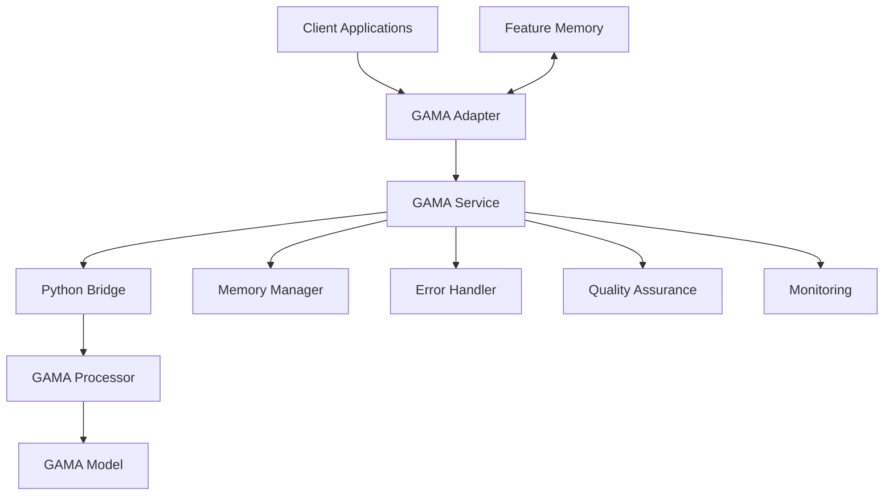

### Key Components

1. **GAMA Service**: Core service that provides audio processing and feature extraction capabilities
2. **GAMA Adapter**: Adapter that integrates GAMA with the grym-synth orchestration system
3. **Python Bridge**: Communication bridge between TypeScript and Python
4. **GAMA Processor**: Python component that handles model operations
5. **Memory Manager**: Manages memory usage for GAMA operations
6. **Error Handler**: Handles errors and implements recovery strategies
7. **Quality Assurance**: Validates outputs to ensure they meet quality standards
8. **Monitoring**: Collects metrics and monitors the health of the GAMA service
9. **Feature Memory**: Stores and retrieves feature vectors for pattern recognition

## Component Details

### GAMA Service

The `GAMAService` class is the main entry point for GAMA functionality:

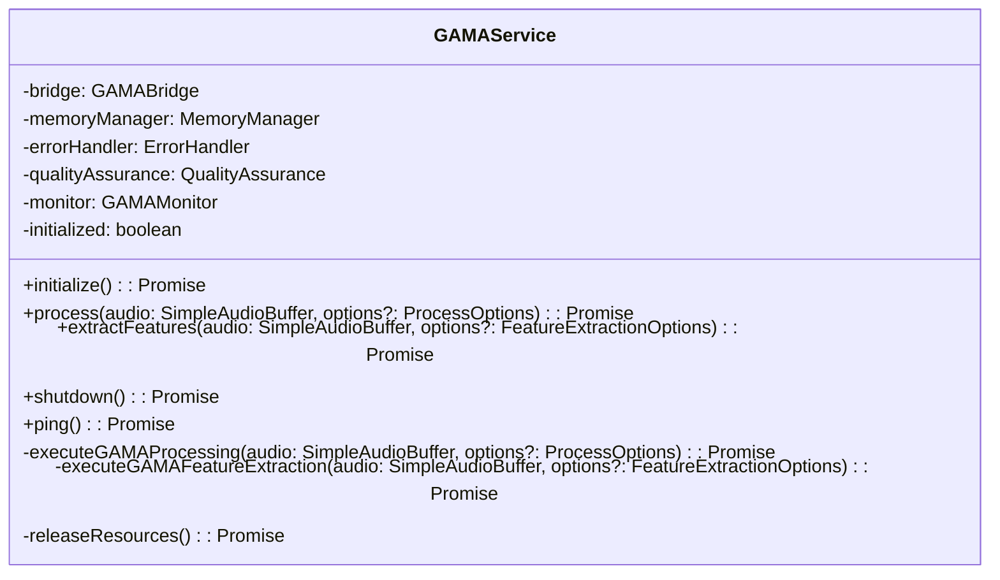

The `GAMAService` is responsible for:

- Initializing the GAMA model and components
- Processing audio with the GAMA model
- Extracting features from audio
- Managing resources and shutting down the service
- Handling errors and implementing recovery strategies
- Validating outputs to ensure quality
- Monitoring performance and resource usage

### GAMA Adapter

The `GAMAAdapter` class adapts the GAMA service to the grym-synth orchestration system:

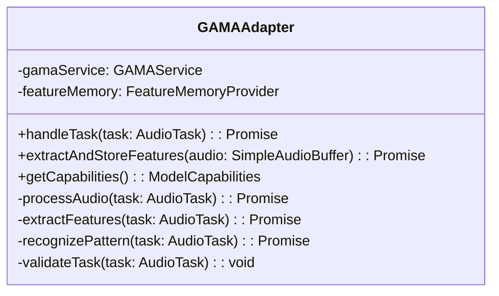

The `GAMAAdapter` is responsible for:

- Handling audio processing tasks
- Extracting and storing features for pattern recognition
- Providing information about the model's capabilities
- Validating tasks before processing

### Python Bridge

The `GAMABridge` class handles communication between TypeScript and Python:

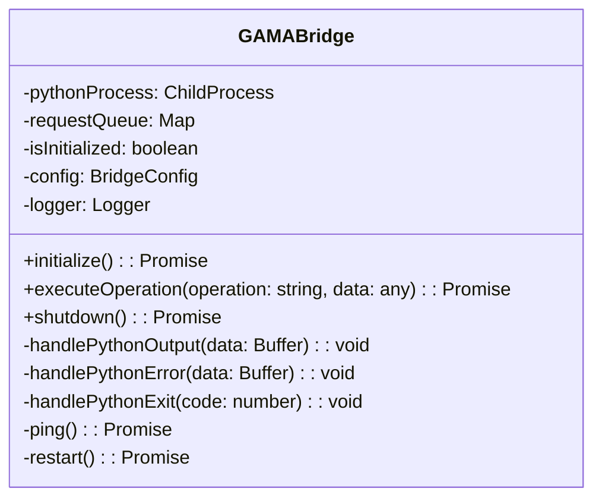

The `GAMABridge` is responsible for:

- Starting and managing the Python process
- Sending operations to the Python process
- Receiving and parsing responses from the Python process
- Handling timeouts and errors in communication
- Restarting the Python process if necessary

### Memory Manager

The `MemoryManager` class manages memory usage for GAMA operations:

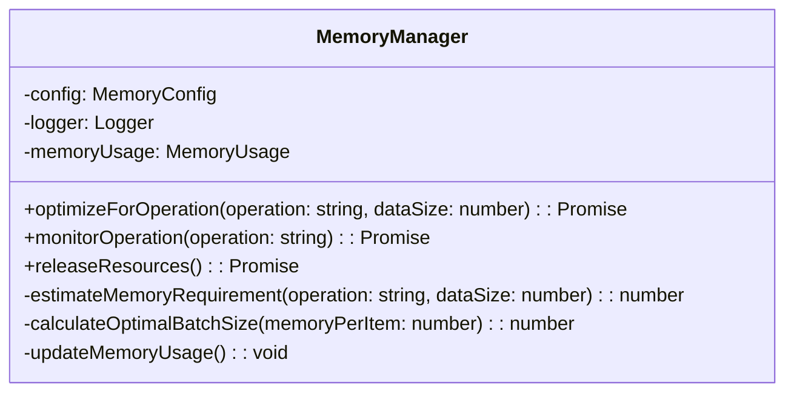

The `MemoryManager` is responsible for:

- Optimizing parameters for operations based on available memory
- Monitoring memory usage during operations
- Releasing resources after operations
- Estimating memory requirements for operations
- Calculating optimal batch sizes

### Error Handler

The `GAMAErrorHandler` class handles errors and implements recovery strategies:

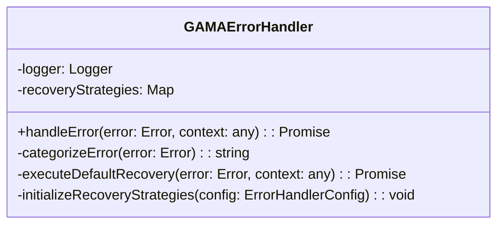

The `GAMAErrorHandler` is responsible for:

- Categorizing errors based on their type and message
- Selecting and executing appropriate recovery strategies
- Logging errors and recovery attempts
- Providing fallback recovery when specific strategies fail

### Quality Assurance

The `GAMAQualityAssurance` class validates outputs to ensure they meet quality standards:

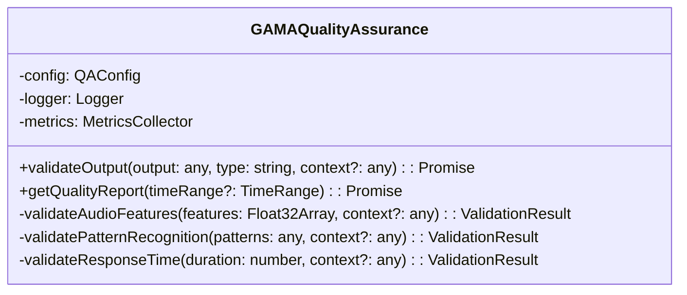

The `GAMAQualityAssurance` is responsible for:

- Validating outputs from GAMA operations
- Checking for anomalies in feature vectors
- Validating pattern recognition results
- Monitoring response times
- Generating quality reports

### Monitoring

The `GAMAMonitor` class collects metrics and monitors the health of the GAMA service:

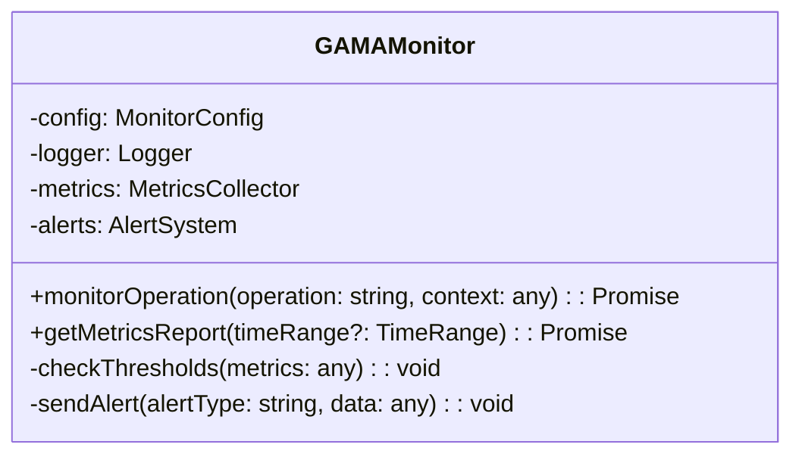

The `GAMAMonitor` is responsible for:

- Collecting metrics for GAMA operations
- Monitoring operation duration and resource usage
- Checking metrics against thresholds
- Sending alerts when thresholds are exceeded
- Generating metrics reports

### Feature Memory

The `FeatureMemory` class stores and retrieves feature vectors for pattern recognition:

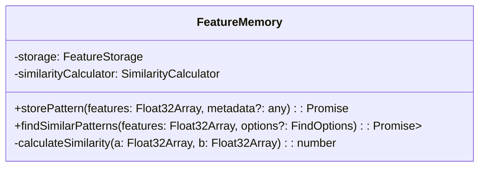

The `FeatureMemory` is responsible for:

- Storing feature vectors with metadata
- Finding similar patterns based on feature similarity
- Calculating similarity between feature vectors
- Managing pattern storage

## Data Flow

### Audio Processing Flow

The following diagram illustrates the data flow for audio processing:

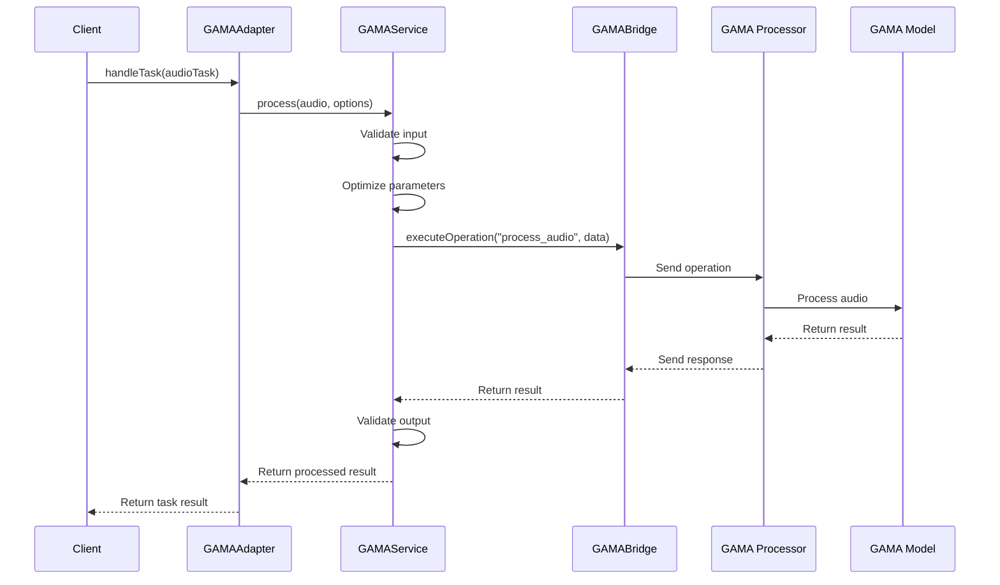

### Feature Extraction Flow

The following diagram illustrates the data flow for feature extraction:

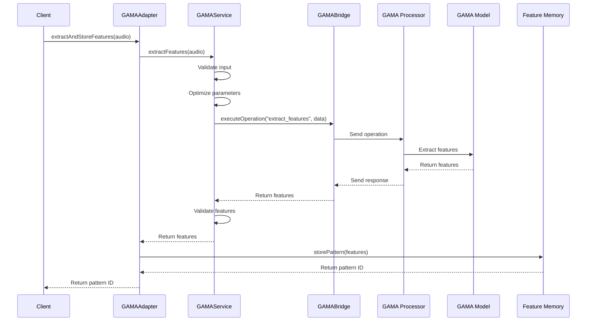

## Design Principles

The GAMA integration follows several key design principles:

### 1. Separation of Concerns

Each component has a clear responsibility:

- `GAMAService`: Core audio processing and feature extraction
- `GAMAAdapter`: Integration with the orchestration system
- `GAMABridge`: Communication with Python
- `MemoryManager`: Memory optimization
- `GAMAErrorHandler`: Error handling and recovery
- `GAMAQualityAssurance`: Output validation
- `GAMAMonitor`: Metrics collection and monitoring
- `FeatureMemory`: Pattern storage and retrieval

### 2. Dependency Injection

Components are designed to be easily replaceable through dependency injection:

```typescript
// Example of dependency injection
const gamaService = new GAMAService({
  bridge: customBridge,
  memoryManager: customMemoryManager,
  errorHandler: customErrorHandler,
  qualityAssurance: customQualityAssurance,
  monitor: customMonitor
});
```

### 3. Error Handling

Comprehensive error handling is implemented at multiple levels:

- Input validation to prevent invalid inputs
- Error categorization to identify error types
- Recovery strategies for different error types
- Fallback mechanisms when recovery fails
- Detailed error logging for troubleshooting

### 4. Monitoring and Metrics

Extensive monitoring and metrics collection:

- Operation duration and resource usage
- Error rates and recovery success rates
- Quality metrics for outputs
- Threshold-based alerting
- Detailed metrics reports

### 5. Extensibility

The architecture is designed to be extensible:

- Custom processors for audio preprocessing and postprocessing
- Custom feature extractors for specialized use cases
- Custom pattern matchers for advanced pattern recognition
- Custom error handlers for specialized error handling
- Plugin system for modular extensions

## Implementation Details

### TypeScript Implementation

The GAMA integration is implemented in TypeScript, with the following key files:

- `GAMAService.ts`: Core service implementation
- `GAMAAdapter.ts`: Adapter implementation
- `GAMABridge.ts`: Bridge implementation
- `MemoryManager.ts`: Memory management implementation
- `GAMAErrorHandler.ts`: Error handling implementation
- `GAMAQualityAssurance.ts`: Quality assurance implementation
- `GAMAMonitor.ts`: Monitoring implementation
- `FeatureMemory.ts`: Feature memory implementation

### Python Implementation

The Python component is implemented in Python, with the following key files:

- `gama_operations.py`: Main Python script
- `gama_processor.py`: GAMA processor implementation
- `gama_model.py`: GAMA model wrapper
- `utils.py`: Utility functions

### Communication Protocol

The TypeScript and Python components communicate using a simple JSON-based protocol:

**Request Format:**
```json
{
  "id": "request-123",
  "operation": "process_audio",
  "data": {
    "audio": [...],
    "options": {
      "quality": "high",
      "maxNewTokens": 100
    }
  }
}
```

**Response Format:**
```json
{
  "id": "request-123",
  "status": "success",
  "result": {
    "transcription": "This is a test transcription",
    "confidence": 0.95,
    "segments": [...]
  }
}
```

**Error Format:**
```json
{
  "id": "request-123",
  "status": "error",
  "error": {
    "message": "Out of memory",
    "type": "MemoryError",
    "details": {...}
  }
}
```

## Performance Considerations

### Memory Management

The GAMA integration includes several memory optimization techniques:

- Dynamic batch sizing based on available memory
- Gradient checkpointing for large models
- Quantization for reduced memory usage
- Memory monitoring and resource release
- Fallback to lower quality settings when memory is constrained

### Concurrency

The GAMA integration handles concurrency through:

- Asynchronous operations with Promises
- Request queuing in the Python bridge
- Operation timeouts to prevent deadlocks
- Resource locking for shared resources
- Graceful shutdown to prevent resource leaks

### Scalability

The architecture supports scalability through:

- Stateless design for horizontal scaling
- Configurable resource limits
- Batch processing for improved throughput
- Monitoring and alerting for capacity planning
- Graceful degradation under load

## Security Considerations

### Input Validation

All inputs are validated to prevent:

- Buffer overflows
- Command injection
- Resource exhaustion
- Invalid configurations

### Process Isolation

The Python process is isolated from the main application:

- Separate process with limited permissions
- Controlled communication through stdin/stdout
- Timeout mechanisms to prevent hanging
- Resource limits to prevent excessive usage

### Error Handling

Errors are handled securely:

- Error messages don't expose sensitive information
- Failed operations don't leave the system in an inconsistent state
- Resource cleanup on errors
- Rate limiting for repeated errors

## Conclusion

The GAMA architecture provides a robust, extensible, and performant foundation for audio processing and feature extraction in the grym-synth. By following clear design principles and implementing comprehensive error handling, monitoring, and quality assurance, the architecture ensures reliable operation and high-quality results.

