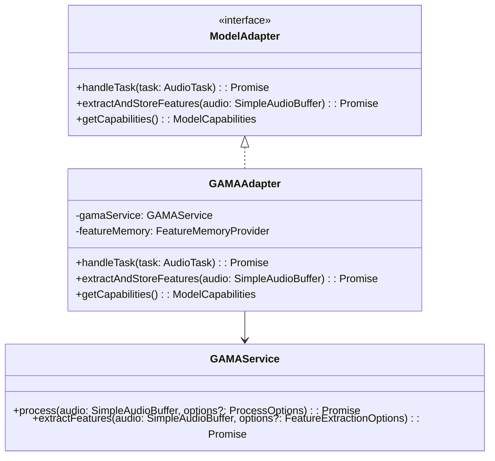
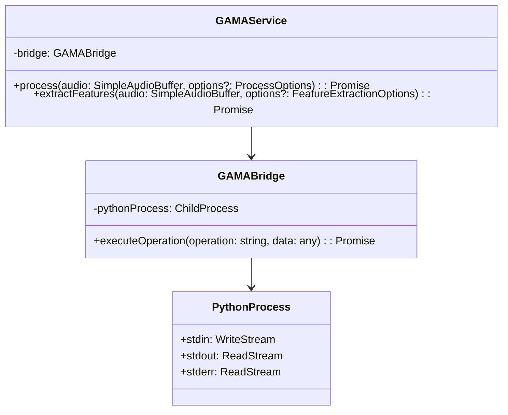
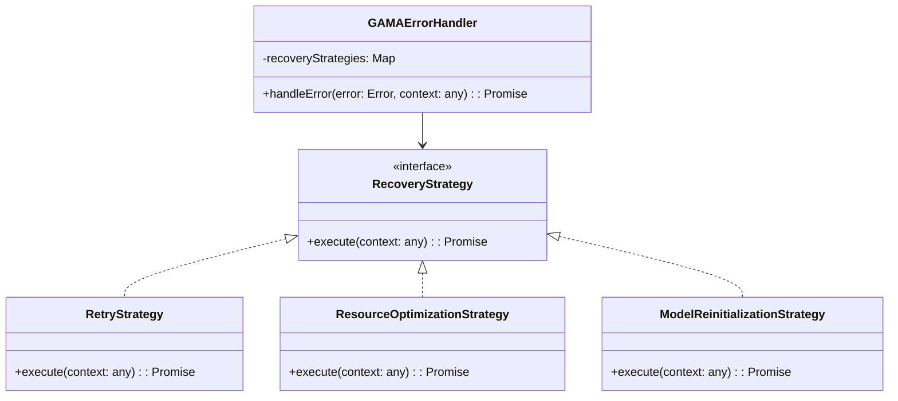
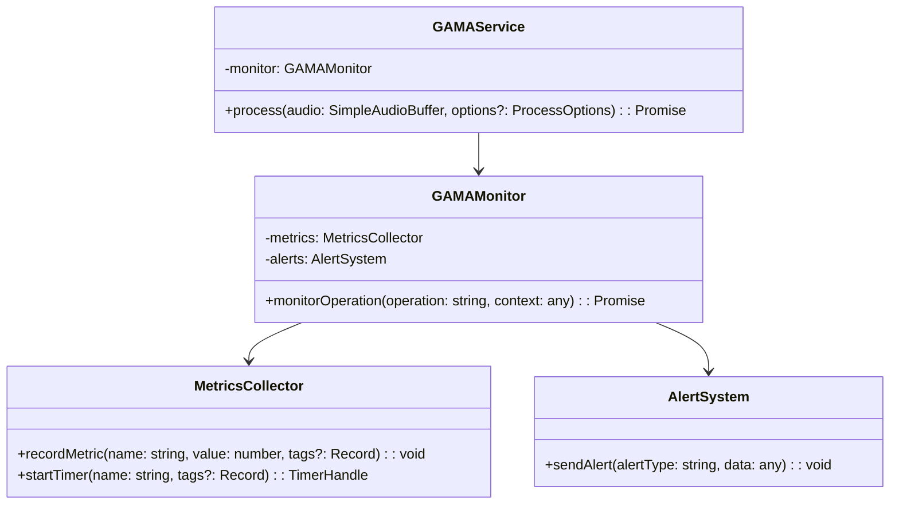

# GAMA Integration Points

## Overview

This document details all integration points between the GAMA component and other components in the grym-synth. It provides comprehensive information about interfaces, data formats, communication protocols, and integration patterns to facilitate seamless interaction with the GAMA system.

## Core Integration Points

### 1. Task Orchestration System

The GAMA integration connects with the grym-synth's task orchestration system through the `GAMAAdapter` class.

#### Interface

```typescript
interface ModelAdapter {
  handleTask(task: AudioTask): Promise<TaskResult>;
  extractAndStoreFeatures(audio: SimpleAudioBuffer): Promise<string>;
  getCapabilities(): ModelCapabilities;
}

class GAMAAdapter implements ModelAdapter {
  constructor(config: {
    gamaService: GAMAService;
    featureMemory: FeatureMemoryProvider;
  });

  async handleTask(task: AudioTask): Promise<TaskResult>;
  async extractAndStoreFeatures(audio: SimpleAudioBuffer): Promise<string>;
  getCapabilities(): ModelCapabilities;
}
```

#### Task Format

```typescript
interface AudioTask {
  id: string;
  type: 'audio.process' | 'audio.extract_features' | 'audio.pattern_recognition';
  timestamp: number;
  data: {
    audio: SimpleAudioBuffer | string; // Audio buffer or path to audio file
    options?: {
      quality?: 'low' | 'medium' | 'high';
      maxNewTokens?: number;
      doSample?: boolean;
      temperature?: number;
      topP?: number;
      topK?: number;
      [key: string]: any;
    };
  };
}
```

#### Result Format

```typescript
interface TaskResult {
  success: boolean;
  data?: any;
  error?: string;
  taskId: string;
  processingTime?: number;
}
```

#### Example Usage

```typescript
// Register GAMA service with the orchestration system
import { GAMAService } from '@grym-synth/gama-integration';
import { GAMAAdapter } from '@grym-synth/gama-integration';
import { registerService } from '../core/service-registry';
import { getFeatureMemoryProvider } from '../services/feature-memory';

// Create GAMA service
const gamaService = new GAMAService({
  id: 'gama',
  modelPath: 'models/gama',
  maxMemory: '4GB',
  device: 'cuda',
  quantization: '8bit'
});

// Create GAMA adapter
const gamaAdapter = new GAMAAdapter({
  gamaService,
  featureMemory: getFeatureMemoryProvider()
});

// Register GAMA service
registerService('gama', gamaService, gamaAdapter);
```

### 2. Feature Memory System

The GAMA integration connects with the feature memory system for pattern storage and retrieval.

#### Interface

```typescript
interface FeatureMemoryProvider {
  storePattern(features: FeatureVector): Promise<string>;
  findSimilarPatterns(
    features: FeatureVector,
    options: FindOptions
  ): Promise<Array<PatternMatch>>;
}

interface FindOptions {
  threshold?: number;
  maxResults?: number;
}

interface PatternMatch {
  id: string;
  similarity: number;
  metadata?: any;
}
```

#### Data Format

```typescript
// Feature vector is a Float32Array
type FeatureVector = Float32Array;

// Pattern match includes ID, similarity score, and optional metadata
interface PatternMatch {
  id: string;
  similarity: number;
  metadata?: any;
}
```

#### Example Usage

```typescript
// Extract and store features
async function extractAndStorePattern(audio: SimpleAudioBuffer) {
  // Extract features using GAMA
  const features = await gamaService.extractFeatures(audio);

  // Store features in feature memory
  const patternId = await featureMemory.storePattern(features, {
    type: 'speech',
    timestamp: Date.now(),
    duration: audio.data.length / audio.sampleRate
  });

  return patternId;
}

// Find similar patterns
async function findSimilarPatterns(audio: SimpleAudioBuffer) {
  // Extract features using GAMA
  const features = await gamaService.extractFeatures(audio);

  // Find similar patterns
  const matches = await featureMemory.findSimilarPatterns(features, {
    threshold: 0.8,
    maxResults: 5
  });

  return matches;
}
```

### 3. Monitoring System

The GAMA integration connects with the monitoring system to report metrics and health status.

#### Interface

```typescript
interface MonitoringSystem {
  recordMetric(name: string, value: number, tags?: Record<string, string>): void;
  startTimer(name: string, tags?: Record<string, string>): TimerHandle;
  recordEvent(name: string, data?: any): void;
  reportHealth(status: 'healthy' | 'degraded' | 'unhealthy', details?: any): void;
}

interface TimerHandle {
  stop(): number; // Returns duration in milliseconds
}
```

#### Metrics Reported

| Metric Name             | Type    | Description                      | Tags                     |
| ----------------------- | ------- | -------------------------------- | ------------------------ |
| `gama.process.duration` | Timer   | Time taken to process audio      | `quality`, `audioLength` |
| `gama.extract.duration` | Timer   | Time taken to extract features   | `audioLength`            |
| `gama.memory.usage`     | Gauge   | Memory used by GAMA              | `type` (heap, rss, etc.) |
| `gama.operations.total` | Counter | Total number of operations       | `operation`              |
| `gama.operations.error` | Counter | Number of failed operations      | `operation`, `errorType` |
| `gama.bridge.restarts`  | Counter | Number of Python bridge restarts | -                        |

#### Health Checks

The GAMA service reports its health status through the following endpoints:

- `/health`: Basic health check
- `/health/deep`: Detailed health check including model status

#### Example Usage

```typescript
// Record metrics during audio processing
async function processAudioWithMetrics(audio: SimpleAudioBuffer, options?: any) {
  // Start timer
  const timer = monitoringSystem.startTimer('gama.process.duration', {
    quality: options?.quality || 'medium',
    audioLength: String(audio.data.length)
  });

  try {
    // Process audio
    const result = await gamaService.process(audio, options);

    // Increment success counter
    monitoringSystem.recordMetric('gama.operations.total', 1, {
      operation: 'process'
    });

    // Record memory usage
    const memoryUsage = process.memoryUsage();
    monitoringSystem.recordMetric('gama.memory.usage', memoryUsage.heapUsed, {
      type: 'heap'
    });

    return result;
  } catch (error) {
    // Increment error counter
    monitoringSystem.recordMetric('gama.operations.error', 1, {
      operation: 'process',
      errorType: error.name
    });

    // Record error event
    monitoringSystem.recordEvent('gama.error', {
      operation: 'process',
      error: error.message,
      stack: error.stack
    });

    throw error;
  } finally {
    // Stop timer
    timer.stop();
  }
}
```

### 4. Configuration System

The GAMA integration connects with the configuration system to load and update configuration.

#### Interface

```typescript
interface ConfigurationSystem {
  getConfig<T>(name: string): T;
  updateConfig<T>(name: string, config: Partial<T>): Promise<T>;
  subscribeToChanges<T>(name: string, callback: (config: T) => void): () => void;
}
```

#### Configuration Schema

```typescript
interface GAMAConfig {
  id: string;
  modelPath: string;
  maxMemory: string;
  device: 'cpu' | 'cuda';
  quantization: '8bit' | '4bit' | 'none';
  logConfig?: LogConfig;
  monitorConfig?: MonitorConfig;
  errorConfig?: ErrorConfig;
  qaConfig?: QAConfig;
  bridgeConfig?: BridgeConfig;
}
```

#### Example Usage

```typescript
// Load configuration
const gamaConfig = configurationSystem.getConfig<GAMAConfig>('gama');

// Create GAMA service with configuration
const gamaService = new GAMAService(gamaConfig);

// Subscribe to configuration changes
const unsubscribe = configurationSystem.subscribeToChanges<GAMAConfig>('gama', async (newConfig) => {
  // Update GAMA service configuration
  await gamaService.updateConfig(newConfig);
});
```

### 5. Logging System

The GAMA integration connects with the logging system to record events and errors.

#### Interface

```typescript
interface LoggingSystem {
  debug(message: string, context?: any): void;
  info(message: string, context?: any): void;
  warn(message: string, context?: any): void;
  error(message: string, context?: any): void;
  child(context: any): LoggingSystem;
}
```

#### Log Categories

| Category       | Description                 |
| -------------- | --------------------------- |
| `gama.service` | GAMA service operations     |
| `gama.bridge`  | Python bridge communication |
| `gama.adapter` | GAMA adapter operations     |
| `gama.memory`  | Memory management           |
| `gama.error`   | Error handling              |
| `gama.qa`      | Quality assurance           |
| `gama.monitor` | Monitoring                  |

#### Example Usage

```typescript
// Create logger
const logger = loggingSystem.child({ component: 'gama.service' });

// Log events
logger.info('Initializing GAMA service', { modelPath: config.modelPath });
logger.debug('Processing audio', { audioLength: audio.data.length, options });
logger.warn('Memory usage high', { memoryUsage: process.memoryUsage() });
logger.error('Failed to process audio', { error: error.message, stack: error.stack });
```

## Secondary Integration Points

### 1. File System

The GAMA integration interacts with the file system to load models and temporary files.

#### File Paths

| Path           | Description                         |
| -------------- | ----------------------------------- |
| `models/gama/` | GAMA model files                    |
| `temp/gama/`   | Temporary files for GAMA operations |
| `logs/gama/`   | GAMA log files                      |
| `cache/gama/`  | GAMA cache files                    |

#### Example Usage

```typescript
// Load model from file system
const modelPath = path.join(process.cwd(), 'models', 'gama');
const modelExists = await fs.promises.access(modelPath).then(() => true).catch(() => false);

if (!modelExists) {
  // Download model
  await downloadModel(modelPath);
}

// Create temporary directory
const tempDir = path.join(process.cwd(), 'temp', 'gama');
await fs.promises.mkdir(tempDir, { recursive: true });
```

### 2. Python Environment

The GAMA integration interacts with the Python environment to execute model operations.

#### Requirements

- Python 3.8 or later
- PyTorch 1.10 or later
- CUDA 11.3 or later (for GPU support)
- Required Python packages:
  - `torch`
  - `numpy`
  - `transformers`
  - `librosa`
  - `soundfile`

#### Environment Variables

| Variable            | Description                                    |
| ------------------- | ---------------------------------------------- |
| `GAMA_MODEL_PATH`   | Path to the GAMA model                         |
| `GAMA_DEVICE`       | Device to use for processing (`cpu` or `cuda`) |
| `GAMA_QUANTIZATION` | Quantization level (`8bit`, `4bit`, or `none`) |
| `GAMA_LOG_LEVEL`    | Log level for Python process                   |
| `GAMA_TEMP_DIR`     | Directory for temporary files                  |

#### Example Usage

```typescript
// Create Python process
const pythonProcess = spawn('python', [
  '-m', 'gama_operations',
  '--model-path', config.modelPath,
  '--device', config.device,
  '--quantization', config.quantization
], {
  env: {
    ...process.env,
    GAMA_MODEL_PATH: config.modelPath,
    GAMA_DEVICE: config.device,
    GAMA_QUANTIZATION: config.quantization,
    GAMA_LOG_LEVEL: config.logConfig?.level || 'info',
    GAMA_TEMP_DIR: path.join(process.cwd(), 'temp', 'gama')
  }
});
```

### 3. Model Registry

The GAMA integration interacts with the model registry to download and verify models.

#### Interface

```typescript
interface ModelRegistry {
  getModelInfo(modelId: string): Promise<ModelInfo>;
  downloadModel(modelId: string, destination: string): Promise<void>;
  verifyModel(modelId: string, modelPath: string): Promise<boolean>;
}

interface ModelInfo {
  id: string;
  version: string;
  size: number;
  checksum: string;
  format: string;
  metadata: any;
}
```

#### Example Usage

```typescript
// Get model information
const modelInfo = await modelRegistry.getModelInfo('gama');

// Download model if needed
if (!await fs.promises.access(config.modelPath).then(() => true).catch(() => false)) {
  await modelRegistry.downloadModel('gama', config.modelPath);
}

// Verify model integrity
const isValid = await modelRegistry.verifyModel('gama', config.modelPath);

if (!isValid) {
  // Re-download model
  await modelRegistry.downloadModel('gama', config.modelPath);
}
```

## Integration Patterns

### 1. Adapter Pattern

The GAMA integration uses the Adapter pattern to connect with the task orchestration system:



### 2. Bridge Pattern

The GAMA integration uses the Bridge pattern to communicate with the Python process:



### 3. Strategy Pattern

The GAMA integration uses the Strategy pattern for error handling:



### 4. Observer Pattern

The GAMA integration uses the Observer pattern for monitoring:



## Data Formats

### 1. Audio Data

The GAMA integration accepts audio data in the following format:

```typescript
interface SimpleAudioBuffer {
  data: Float32Array;
  channels: number;
  sampleRate: number;
}
```

Example:
```typescript
const audio = {
  data: new Float32Array(48000), // 1 second of audio at 48kHz
  channels: 1, // Mono
  sampleRate: 48000
};
```

### 2. Processing Result

The GAMA integration returns processing results in the following format:

```typescript
interface ProcessResult {
  transcription: string;
  confidence: number;
  segments?: Array<{
    text: string;
    start: number;
    end: number;
    confidence: number;
  }>;
  duration?: number;
  processingTime?: number;
  memoryUsage?: {
    heap: number;
    rss: number;
  };
}
```

Example:
```typescript
const result = {
  transcription: "This is a test transcription.",
  confidence: 0.95,
  segments: [
    {
      text: "This is a test",
      start: 0,
      end: 1.5,
      confidence: 0.96
    },
    {
      text: "transcription.",
      start: 1.6,
      end: 2.5,
      confidence: 0.94
    }
  ],
  duration: 2.5,
  processingTime: 1234,
  memoryUsage: {
    heap: 1024 * 1024 * 100, // 100 MB
    rss: 1024 * 1024 * 200 // 200 MB
  }
};
```

### 3. Feature Vector

The GAMA integration returns feature vectors as Float32Array:

```typescript
type FeatureVector = Float32Array;
```

Example:
```typescript
const features = new Float32Array(768); // 768-dimensional feature vector
```

### 4. Pattern Match

The GAMA integration returns pattern matches in the following format:

```typescript
interface PatternMatch {
  id: string;
  similarity: number;
  metadata?: any;
}
```

Example:
```typescript
const matches = [
  {
    id: "pattern-1234567890",
    similarity: 0.95,
    metadata: {
      type: "speech",
      timestamp: 1614556800000,
      duration: 2.5
    }
  },
  {
    id: "pattern-0987654321",
    similarity: 0.85,
    metadata: {
      type: "speech",
      timestamp: 1614556700000,
      duration: 3.2
    }
  }
];
```

## Communication Protocols

### 1. TypeScript-Python Communication

The GAMA integration uses a JSON-based protocol for communication between TypeScript and Python:

#### Request Format

```json
{
  "id": "request-123",
  "operation": "process_audio",
  "data": {
    "audio": [...],
    "options": {
      "quality": "high",
      "maxNewTokens": 100
    }
  }
}
```

#### Response Format

```json
{
  "id": "request-123",
  "status": "success",
  "result": {
    "transcription": "This is a test transcription",
    "confidence": 0.95,
    "segments": [...]
  }
}
```

#### Error Format

```json
{
  "id": "request-123",
  "status": "error",
  "error": {
    "message": "Out of memory",
    "type": "MemoryError",
    "details": {...}
  }
}
```

### 2. REST API

The GAMA integration exposes a REST API for external integration:

#### Endpoints

| Endpoint                      | Method | Description                 |
| ----------------------------- | ------ | --------------------------- |
| `/api/audio/process`          | POST   | Process audio               |
| `/api/audio/extract-features` | POST   | Extract features from audio |
| `/api/audio/find-similar`     | POST   | Find similar patterns       |
| `/api/health`                 | GET    | Get health status           |
| `/api/metrics`                | GET    | Get metrics                 |

#### Example Request

```http
POST /api/audio/process HTTP/1.1
Content-Type: multipart/form-data; boundary=----WebKitFormBoundary7MA4YWxkTrZu0gW

------WebKitFormBoundary7MA4YWxkTrZu0gW
Content-Disposition: form-data; name="audio"; filename="audio.wav"
Content-Type: audio/wav

[Binary audio data]
------WebKitFormBoundary7MA4YWxkTrZu0gW
Content-Disposition: form-data; name="options"
Content-Type: application/json

{
  "quality": "high",
  "maxNewTokens": 100
}
------WebKitFormBoundary7MA4YWxkTrZu0gW--
```

#### Example Response

```http
HTTP/1.1 200 OK
Content-Type: application/json

{
  "transcription": "This is a test transcription.",
  "confidence": 0.95,
  "segments": [
    {
      "text": "This is a test",
      "start": 0,
      "end": 1.5,
      "confidence": 0.96
    },
    {
      "text": "transcription.",
      "start": 1.6,
      "end": 2.5,
      "confidence": 0.94
    }
  ],
  "duration": 2.5,
  "processingTime": 1234
}
```

### 3. WebSocket API

The GAMA integration also supports WebSocket for real-time communication:

#### Connection

```javascript
const socket = new WebSocket('ws://localhost:3000/api/audio/stream');
```

#### Messages

| Message Type         | Direction       | Description        |
| -------------------- | --------------- | ------------------ |
| `process_audio`      | Client → Server | Process audio      |
| `processing_started` | Server → Client | Processing started |
| `processing_result`  | Server → Client | Processing result  |
| `extract_features`   | Client → Server | Extract features   |
| `extraction_started` | Server → Client | Extraction started |
| `extraction_result`  | Server → Client | Extraction result  |
| `error`              | Server → Client | Error message      |

#### Example Client Message

```json
{
  "type": "process_audio",
  "payload": {
    "audio": "base64-encoded-audio-data",
    "options": {
      "quality": "high",
      "maxNewTokens": 100
    }
  }
}
```

#### Example Server Message

```json
{
  "type": "processing_result",
  "result": {
    "transcription": "This is a test transcription.",
    "confidence": 0.95,
    "segments": [
      {
        "text": "This is a test",
        "start": 0,
        "end": 1.5,
        "confidence": 0.96
      },
      {
        "text": "transcription.",
        "start": 1.6,
        "end": 2.5,
        "confidence": 0.94
      }
    ],
    "duration": 2.5,
    "processingTime": 1234
  }
}
```

## Integration Best Practices

### 1. Error Handling

- Always handle errors from GAMA operations
- Implement appropriate retry logic for transient errors
- Provide fallback behavior for critical operations
- Log detailed error information for troubleshooting

Example:
```typescript
try {
  const result = await gamaService.process(audio, options);
  return result;
} catch (error) {
  logger.error('Failed to process audio', { error: error.message });

  if (error.message.includes('timeout')) {
    // Retry with longer timeout
    return await gamaService.process(audio, { ...options, timeout: 60000 });
  } else if (error.message.includes('memory')) {
    // Retry with lower quality
    return await gamaService.process(audio, { ...options, quality: 'low' });
  } else {
    // Fallback to default response
    return {
      transcription: 'Failed to process audio',
      confidence: 0,
      processingTime: 0
    };
  }
}
```

### 2. Resource Management

- Release resources after use
- Implement proper shutdown procedures
- Monitor resource usage and implement limits
- Use batch processing for better efficiency

Example:
```typescript
// Process audio in batches
async function processBatch(audioFiles: SimpleAudioBuffer[]) {
  const results = [];

  // Process in batches of 5
  for (let i = 0; i < audioFiles.length; i += 5) {
    const batch = audioFiles.slice(i, i + 5);
    const batchResults = await Promise.all(
      batch.map(audio => gamaService.process(audio))
    );
    results.push(...batchResults);

    // Release resources after each batch
    await gamaService.releaseResources();
  }

  return results;
}

// Proper shutdown
async function shutdown() {
  // Shutdown GAMA service
  await gamaService.shutdown();

  // Close other resources
  await closeLogFiles();
  await closeMetricsCollector();
}
```

### 3. Performance Optimization

- Use appropriate quality settings for different use cases
- Implement caching for frequently used results
- Use streaming for large audio files
- Optimize memory usage for large operations

Example:
```typescript
// Cache for processed results
const cache = new Map();

async function processWithCache(audio: SimpleAudioBuffer, options?: any) {
  // Generate cache key
  const audioHash = hashAudio(audio);
  const optionsHash = hashOptions(options);
  const cacheKey = `${audioHash}-${optionsHash}`;

  // Check cache
  if (cache.has(cacheKey)) {
    return cache.get(cacheKey);
  }

  // Process audio
  const result = await gamaService.process(audio, options);

  // Cache result
  cache.set(cacheKey, result);

  // Limit cache size
  if (cache.size > 1000) {
    const oldestKey = cache.keys().next().value;
    cache.delete(oldestKey);
  }

  return result;
}
```

### 4. Monitoring and Logging

- Implement comprehensive logging for all operations
- Monitor performance metrics and resource usage
- Set up alerts for critical issues
- Implement health checks for service status

Example:
```typescript
// Structured logging
function processAudioWithLogging(audio: SimpleAudioBuffer, options?: any) {
  const requestId = uuidv4();

  logger.info('Processing audio', {
    requestId,
    audioLength: audio.data.length,
    audioChannels: audio.channels,
    audioSampleRate: audio.sampleRate,
    options
  });

  const startTime = Date.now();

  return gamaService.process(audio, options)
    .then(result => {
      const duration = Date.now() - startTime;

      logger.info('Audio processed successfully', {
        requestId,
        duration,
        transcriptionLength: result.transcription.length,
        confidence: result.confidence
      });

      // Record metrics
      metrics.recordHistogram('gama.process.duration', duration);
      metrics.recordGauge('gama.process.confidence', result.confidence);

      return result;
    })
    .catch(error => {
      const duration = Date.now() - startTime;

      logger.error('Failed to process audio', {
        requestId,
        duration,
        error: error.message,
        stack: error.stack
      });

      // Record error metrics
      metrics.incrementCounter('gama.process.errors');

      throw error;
    });
}
```

## Conclusion

This document provides a comprehensive guide to all integration points in the GAMA component. By following these guidelines and best practices, you can effectively integrate GAMA with other components in the grym-synth and build robust audio processing applications.

